# Attachment Access Control Flow Diagrams

## Access Control Decision Flow

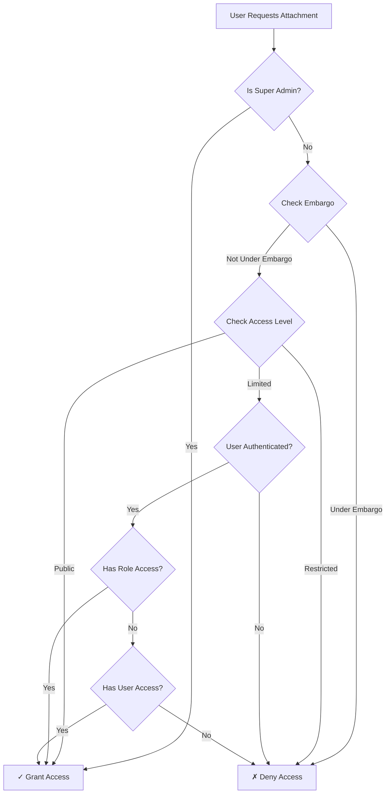

## Embargo Check Flow

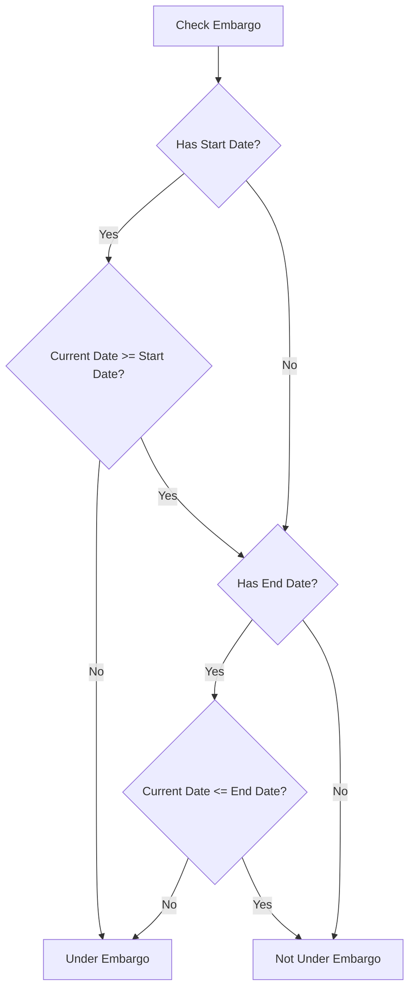

## Access Level Relationships

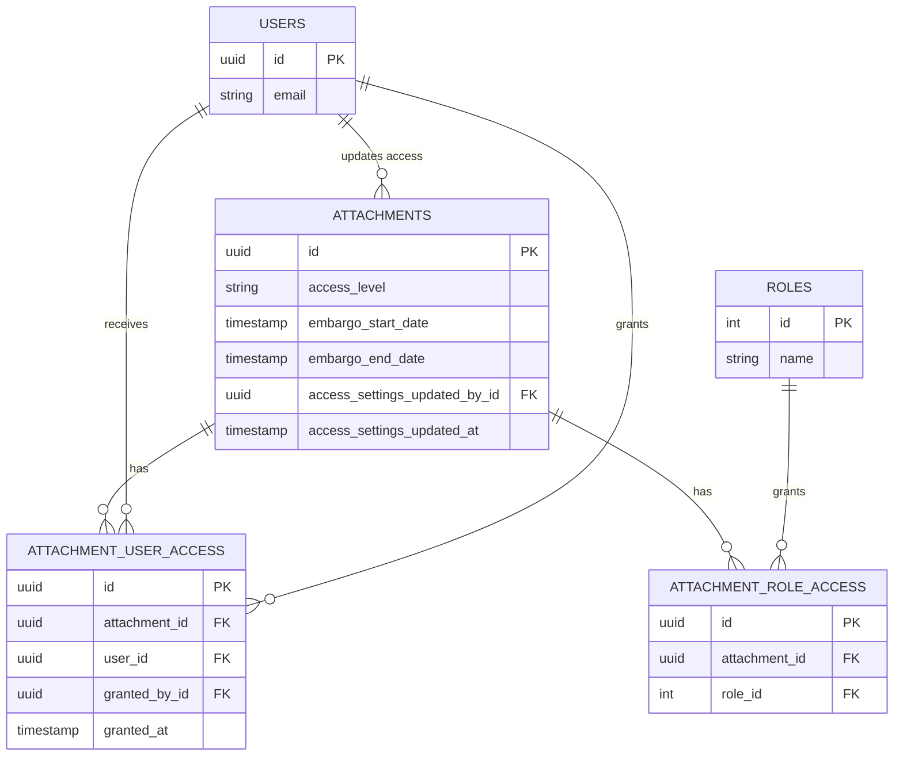

## Typical Usage Scenarios

### Scenario 1: Public Document
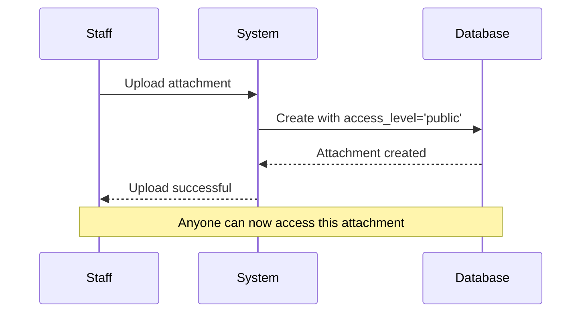

### Scenario 2: Staff-Only Document
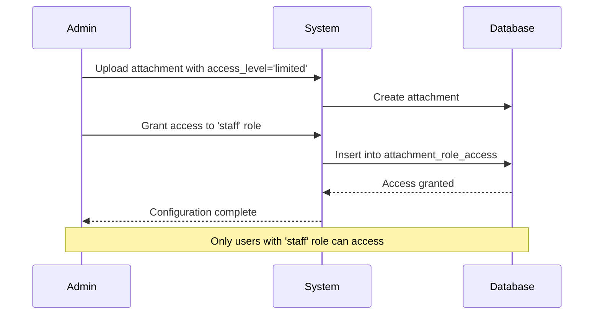

### Scenario 3: Embargoed Research Paper
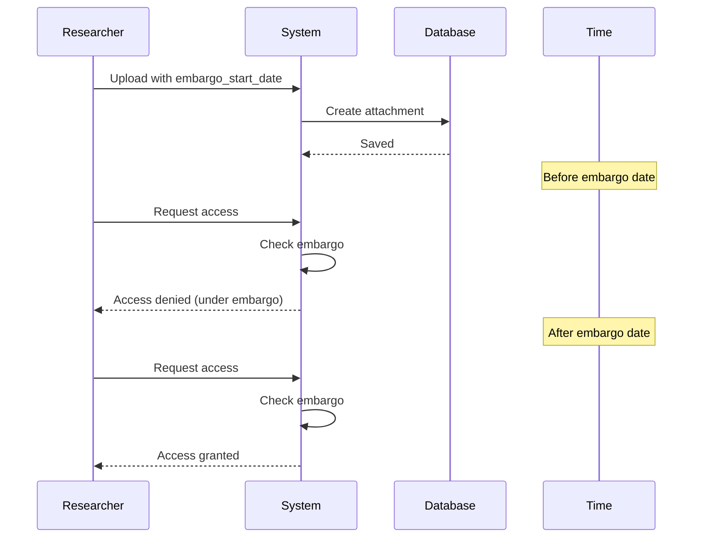

### Scenario 4: Guest User Access
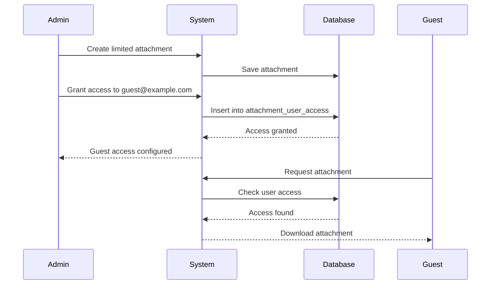

## Access Matrix Visualization

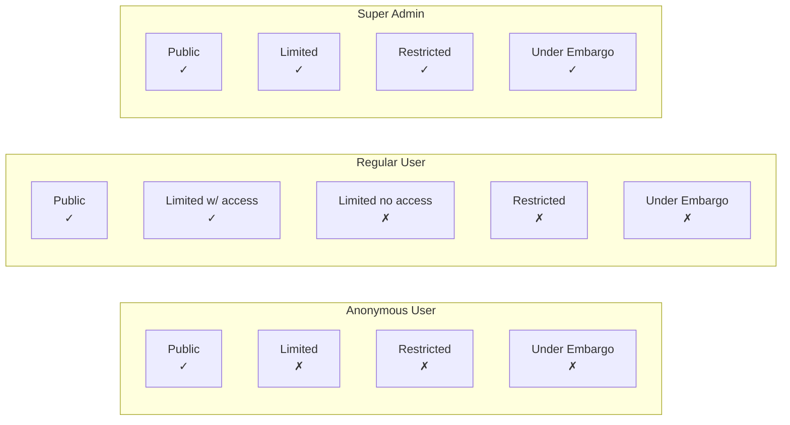

## State Transitions

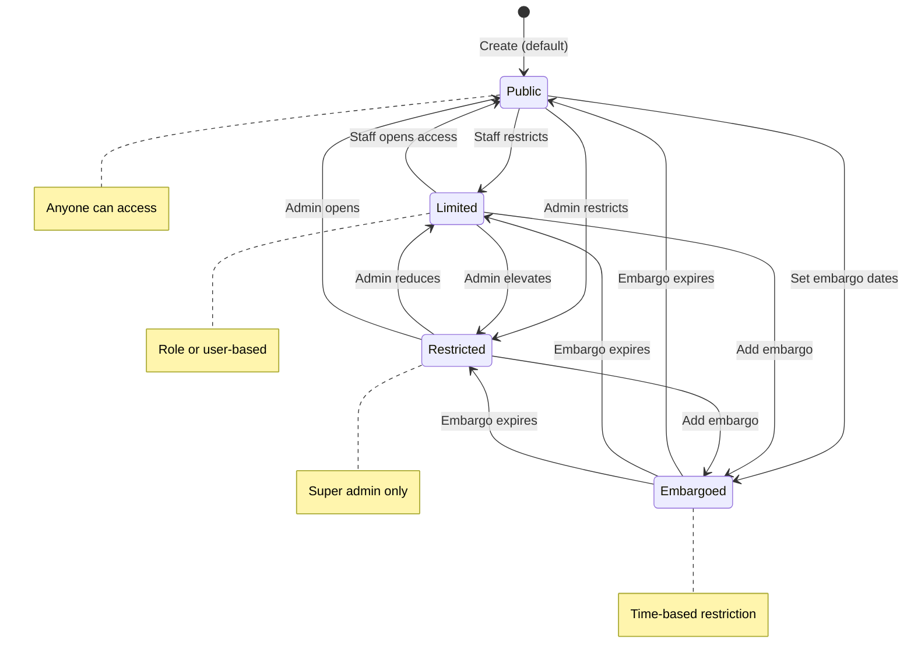

## Query Filtering Process

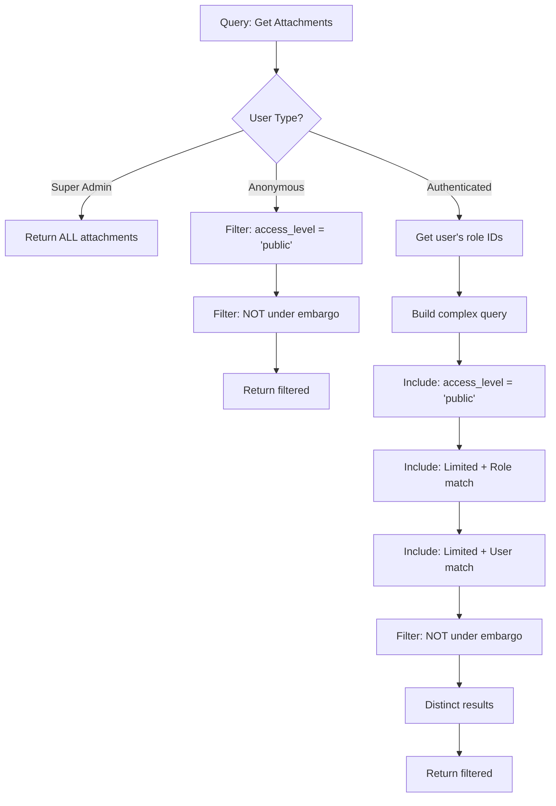

## Bulk Operations Flow

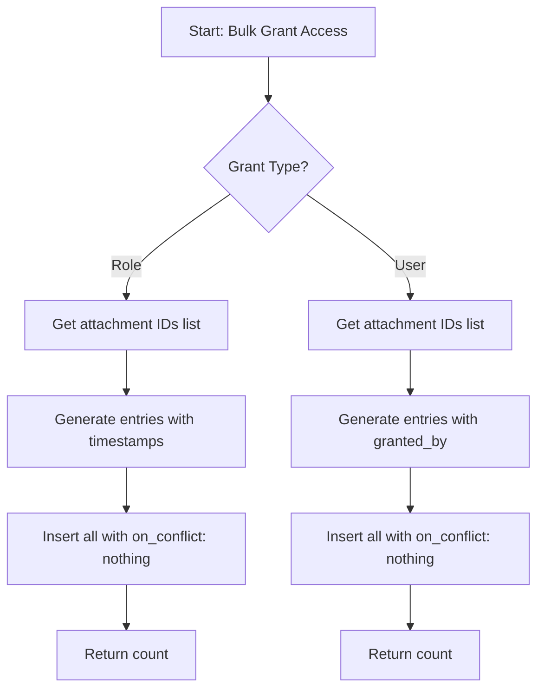

## Access Summary Aggregation

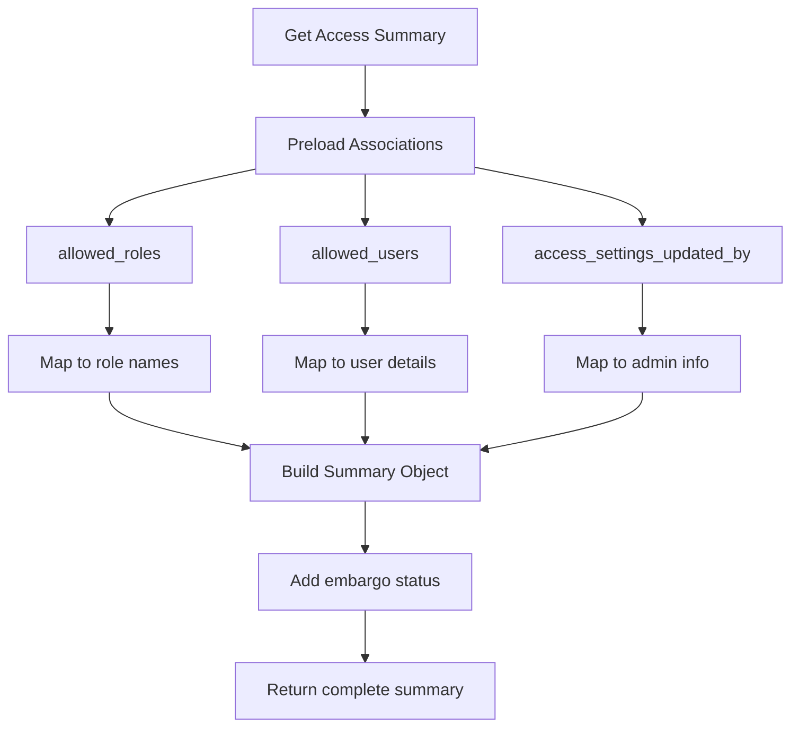

## Legend

- ✓ = Access Granted
- ✗ = Access Denied
- FK = Foreign Key
- PK = Primary Key

## Notes

1. **Super Admin**: Always has access, bypasses all restrictions
2. **Embargo**: Time-based restriction, checked before access level
3. **Limited Access**: Requires authentication AND (role OR user access)
4. **Public**: No restrictions (except embargo)
5. **Restricted**: Only super_admin can access
