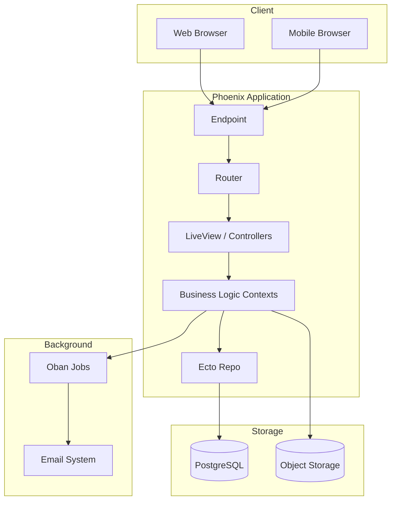

# Architecture

This section provides an overview of VOILE's system architecture, data flow patterns, and design decisions.

## Overview

VOILE is built on the **Elixir/Phoenix** stack, leveraging the BEAM virtual machine for high concurrency, fault tolerance, and real-time capabilities. The application follows Phoenix conventions with LiveView for interactive UIs and Ecto for database interactions.

## Documentation

### Architecture Overview

Comprehensive documentation of the system architecture, including module families, data flow, and user journeys.

[Read the Architecture Overview →](overview.md)

**Key Topics:**

- System architecture layers
- Module family structure (Catalog, Circulation, etc.)
- Data flow diagrams
- Database relationships
- State management patterns
- Performance considerations

### Data Flow Diagrams

Visual diagrams showing how data flows through the system, including LiveView streams and attachment handling.

[View Data Flow Diagrams →](data-flow.md)

**Key Topics:**

- Client-server data flow
- Presigned URL handling for attachments
- LiveView stream management for collections

### System Diagrams

Mermaid diagram source for the complete system architecture.

[View System Diagrams →](diagrams.mmd)

## Technology Stack

### Backend

| Technology | Version | Purpose |
|------------|---------|---------|
| Elixir | ~> 1.18 | Programming language |
| Phoenix | ~> 1.8 | Web framework |
| Phoenix LiveView | - | Real-time UI |
| Ecto | - | Database wrapper |
| PostgreSQL | 14+ | Primary database |
| Oban | - | Background job processing |

### Frontend

| Technology | Purpose |
|------------|---------|
| Phoenix LiveView | Interactive UI without JavaScript |
| Tailwind CSS | Utility-first CSS framework |
| DaisyUI | UI component library |
| esbuild | JavaScript bundling |

### Infrastructure

| Technology | Purpose |
|------------|---------|
| Podman/Docker | Containerization |
| S3-compatible storage | Attachment storage |
| SMTP/Gmail API | Email delivery |

## High-Level Architecture

## Key Design Patterns

### LiveView Streams

VOILE uses Phoenix LiveView streams for efficient collection rendering:

- Append/prepend items without full re-renders
- Reset streams when filtering
- Stream-based pagination for large datasets

### Context-Based Architecture

Business logic is organized into contexts:

- `Voile.Schema.Catalog` - Collections, Items, Attachments
- `Voile.Schema.Library` - Circulation, Fines, Reservations
- `Voile.Schema.Accounts` - Users, Roles, Permissions
- `Voile.Schema.System` - Nodes, Settings, Configuration

### Multi-Tenant Design

VOILE supports multi-node (branch) deployments:

- Each node can have independent settings
- Items belong to specific nodes
- Users can be assigned to nodes
- Reports can be scoped by node

## Related Documentation

- [Catalog Module Guide](../features/catalog/module-guide.md) - Catalog architecture details
- [Circulation Module Guide](../features/circulation/module-guide.md) - Circulation architecture details
 - [GLAM Module Notes](../features/glam/manual.md) - GLAM namespace structure