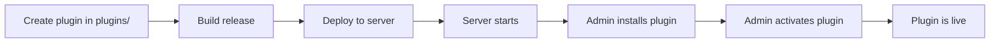

# Plugin Developer Guide

This guide explains how to create, test, and deploy plugins for Voile.

---

## Prerequisites

- Elixir `1.18+` and Erlang `OTP 27+`
- Familiarity with Phoenix and LiveView
- Understanding of Ecto migrations
- Access to a Voile installation for testing

---

## Plugin Location

All Voile plugins are stored in the `plugins/` directory at the project root:

```
voile/
├── lib/voile/           # Core Voile code (untouched by plugins)
├── lib/voile_web/       # Core web interface
├── plugins/             # ← All plugins go here
│   ├── voile_locker_luggage/
│   ├── voile_isbn_lookup/
│   └── voile_exhibit_scheduler/
├── priv/
├── assets/
└── config/
```

This separation ensures:
- Core code remains clean and unmodified
- Plugins are easy to find and manage
- Clear boundary between core and extensions
- Simple git ignore rules for excluding plugins

### Managing plugins stored in separate repos

If you keep each plugin in its own GitHub repository you may be tempted to
add it to the main application's `deps` so `mix deps.get` can fetch updates.
That only works if the plugin does **not** depend on `:voile` at compile time.
A compile‑time dependency is what causes the "loop compile" error you
mentioned – Mix tries to compile Voile to build the plugin and the plugin
tries to compile Voile again, resulting in a circular compilation failure.

There are two idiomatic ways to keep plugins in external repos without
triggering a cycle:

1. **Clone (or submodule) into `plugins/` and update via Git.**
   ```bash
   # add once
   git submodule add https://github.com/your-org/voile_sop_manager.git plugins/voile_sop_manager

   # later, pull the latest
   git -C plugins/voile_sop_manager pull
   # or, for all submodules:
   git submodule update --remote --merge
   ```
   A small script or mix task can automate pulling every `plugins/*` repo.
   Voile will automatically discover and load the OTP app at runtime, and
   since the plugin is not in `deps` Mix never tries to compile Voile for it.

2. **Declare the plugin as a Git/Hex dependency, but ensure the plugin
   itself has no `:voile` dep.**
   ```elixir
   defp deps do
     [
       {:voile_sop_manager,
        git: "https://github.com/your-org/voile_sop_manager.git",
        tag: "v1.2.0"}
     ]
   end
   ```
   The plugin’s `mix.exs` must only list generic libraries (`phoenix`,
   `ecto_sql`, etc.) and **never** `{:voile, …}`. Voile modules are available
   at runtime through the plugin manager, so there is no compile‑time
   requirement. You can then run `mix deps.update voile_sop_manager` to
   fetch updates the same way you would for any other library.

Both methods avoid circular compilation. The first is simplest when you
prefer to treat plugins as part of the source tree; the second uses Mix’s
normal dependency resolver but still keeps the runtime boundary clean.

!!! warning "Avoid compile‑time Voile deps"
    The only reason you see a loop is because the plugin is declaring a
    compile‑time dependency on Voile. **Remove that dependency** and you can
    freely add the plugin to `mix.exs` or update it with git.  Plugins should
    compile independently and rely on Voile only when they are started by the
    host application.

## Developing plugins alongside Voile

Active development usually involves editing the plugin **and** running the
main Voile project to verify behaviour. There are a few simple tricks to make
this pleasant:

1. **Keep the plugin repository separate.**
   - Clone it next to the Voile repo rather than inside `plugins/`:
     ```bash
     cd ~/Development
     git clone git@github.com/your-org/voile.git
     git clone git@github.com/your-org/voile_sop_manager.git
     ```
   - Open a multi‑root workspace in VS Code containing both folders. Each
     project gets its own ElixirLS process; the warnings about
     `Voile.Repo`/`Voile.Plugin` will only appear in the plugin window.

2. **Silence harmless warnings.**
   The plugin doesn’t compile against Voile, so ElixirLS and Dialyzer will
   complain about missing modules. The ignore file you pasted earlier is
   exactly the right start – make sure it lives in the root of the plugin
   repo and that `elixirLS.dialyzerWarnOverrides` is enabled in
   `.vscode/settings.json` if you use VS Code.

   If the warnings still appear (ElixirLS sometimes ignores the ignore file)
   you can give the compiler some actual definitions by adding a "dev stub"
   module. Create a file such as `lib/dev_stubs.ex` in the plugin project with
   contents similar to the following:

   ```elixir
   # lib/dev_stubs.ex
   if Code.ensure_loaded?(Voile) == {:module, Voile} do
     # running inside Voile, real modules exist – don’t define stubs
     nil
   else
     defmodule Voile do
       defmodule Repo do
         use Ecto.Repo, otp_app: :voile_sop_manager, adapter: Ecto.Adapters.Postgres
       end
     end

     defmodule Voile.Plugin do
       @callback metadata() :: map()
       @callback on_install() :: :ok | {:ok, any()} | {:error, any()}
       # …other callbacks copied from core behaviour…
       defmacro __using__(_opts) do
         quote do
           @behaviour Voile.Plugin
         end
       end
     end

     defmodule Voile.Plugins do
       def get_plugin_setting(_id, _key, default), do: default
       def put_plugin_setting(_id, _key, _val), do: :ok
     end

     defmodule Voile.Hooks do
       def register(_hook, _handler, _opts \ []), do: :ok
       def unregister_all(_mod), do: :ok
     end

     # add further stub modules as necessary
   end
   ```

   This file is compiled only when the real `Voile` module is absent, so it
   has no effect once the plugin is loaded by the host application. You can
   safely keep it in your repo during development, but either:
   
   * delete it or move it out before shipping the plugin to a Voile
     installation, or
   * add it to `.gitignore` so it never ends up in the deployed code.

   With either the ignore file *or* a dev stub in place you should stop
   seeing warnings about `Voile.Repo`, `Voile.Plugin` etc. while working on
   the plugin in isolation.

3. **Use a path override when running the host app.**
   In `voile/mix.exs` add:
   ```elixir
   defp deps do
     [
       # other deps …
       {:voile_sop_manager, path: "../voile_sop_manager", override: true}
     ]
   end
   ```
   This tells Mix to compile the local plugin source instead of fetching a
   release from Git. After changing the plugin, run `mix deps.compile
   voile_sop_manager` in the Voile repo and restart the server. You can also
   point at any other local path – it doesn’t have to live under `plugins/`.

4. **Optionally symlink into `plugins/` or use a submodule when you need
   the app to discover it.**
   When Voile loads plugins it looks under `plugins/` by default, so you
   can create a symlink or add the repo as a Git submodule at `plugins/` for
   installation testing.  If you use a submodule, remove the corresponding
   `plugins/*` ignore rule or explicitly un‑ignore the directory so Git will
   track the submodule reference.

5. **Git ignore considerations.**
   The main Voile repo ships with:
   ```gitignore
   # Plugins - ignore all plugin directories but keep README
   /plugins/*
   !/plugins/README.md
   ```
   This keeps end‑user plugin copies out of version control. During
   development you can:
   * remove or comment out the `/plugins/*` line, or
   * explicitly add a submodule (which Git tracks despite the ignore), or
   * simply work outside of `plugins/` and use the path override described
     above.  There’s no need to nest repositories unless you prefer
     submodules – in fact nesting Git repos makes operations like `git add`
     tricky if the inner repo isn’t a submodule.

With these steps you can edit a plugin project independently, run Dialyzer
without noise, and easily exercise changes inside a running Voile server.
When you’re ready to publish, push the plugin repo to GitHub and switch the
main app’s dependency back to the Git URL or Hex package as described above.

---


## Plugin Structure

A plugin is a standard OTP application with a specific structure:

```
plugins/voile_my_plugin/                 # ← Located in plugins/ directory
├── mix.exs                              # OTP app definition
├── README.md
├── lib/
│   ├── voile_my_plugin.ex               # Main module (implements Voile.Plugin)
│   └── voile_my_plugin/
│       ├── migrator.ex                  # Migration runner
│       ├── my_entity.ex                 # Ecto schema(s)
│       ├── my_entities.ex               # Context module(s)
│       ├── settings.ex                  # Settings helper (optional)
│       └── web/
│           └── live/
│               ├── index_live.ex        # Plugin UI
│               └── components/
│                   └── widget.ex        # Dashboard widget (optional)
└── priv/
    └── migrations/
        └── 20240601000001_create_plugin_my_plugin_entities.exs
```

---

## Step 1: Create the OTP Application

Create a new Elixir project in the `plugins/` directory:

```bash
# From Voile root directory
cd plugins
mix new voile_my_plugin --sup
```

Update `mix.exs` to declare dependencies:

```elixir
defmodule VoileMyPlugin.MixProject do
  use Mix.Project

  def project do
    [
      app: :voile_my_plugin,
      version: "1.0.0",
      elixir: "~> 1.18",
      start_permanent: Mix.env() == :prod,
      deps: deps()
    ]
  end

  def application do
    [
      extra_applications: [:logger],
      mod: {VoileMyPlugin.Application, []}
    ]
  end

  defp deps do
    [
      {:phoenix, "~> 1.8"},
      {:phoenix_live_view, "~> 1.0"},
      {:ecto_sql, "~> 3.12"}
      # NOTE: Do NOT add {:voile, path: "../../"} here!
      # Plugins are loaded at runtime by Voile's PluginManager.
      # Adding Voile as a dependency creates a circular dependency.
    ]
  end
end
```

!!! warning "No Circular Dependencies"
    **Do NOT add `{:voile, path: "../../"}` to your plugin's `mix.exs`!**
    
    This creates a circular dependency because:
    1. Voile would try to compile the plugin
    2. The plugin would try to compile Voile
    3. Mix detects the module is being defined twice and fails
    
    Plugins are discovered and loaded at runtime by [`Voile.PluginManager`](/reference/plugin-manager/). The plugin code has access to Voile's modules (like `Voile.Repo`) at runtime without needing a compile-time dependency.

---

## Step 2: Implement the Plugin Behaviour

Create the main module that implements `Voile.Plugin`:

```elixir
# lib/voile_my_plugin.ex
defmodule VoileMyPlugin do
  @behaviour Voile.Plugin

  @impl true
  def metadata do
    %{
      id: "my_plugin",                          # Unique snake_case identifier
      name: "My Plugin",
      version: "1.0.0",
      author: "Your Institution",
      description: "Description of what this plugin does.",
      license_type: :free,                      # :free or :premium
      icon: "🔧",                               # Optional emoji icon
      tags: ["utility", "custom"]               # Optional tags
    }
  end

  @impl true
  def on_install do
    # Run migrations - called ONCE when first installed
    VoileMyPlugin.Migrator.run()
  end

  @impl true
  def on_activate do
    # Called when activated (including after server restart)
    # Start any GenServers, schedule jobs, etc.
    :ok
  end

  @impl true
  def on_deactivate do
    # Called when deactivated by admin
    # Stop any processes, but DON'T drop data
    :ok
  end

  @impl true
  def on_uninstall do
    # Called when uninstalling with data removal
    # Rollback migrations (drops tables)
    VoileMyPlugin.Migrator.rollback()
  end

  @impl true
  def on_update(_old_version, _new_version) do
    # Called when plugin is updated
    # Run any new migrations
    VoileMyPlugin.Migrator.run()
  end

  @impl true
  def hooks do
    [
      {:dashboard_widgets, &__MODULE__.add_widget/1},
      {:collection_after_save, &__MODULE__.on_collection_created/1}
    ]
  end

  @impl true
  def routes do
    [
      {"/", VoileMyPlugin.Web.Live.IndexLive, :index},
      {"/settings", VoileMyPlugin.Web.Live.SettingsLive, :settings},
      {"/:id", VoileMyPlugin.Web.Live.ShowLive, :show}
    ]
  end

  @impl true
  def settings_schema do
    [
      %{key: :api_key, type: :string, label: "API Key", required: true, secret: true},
      %{key: :max_items, type: :integer, label: "Max Items", default: 100},
      %{key: :enabled, type: :boolean, label: "Enable Feature", default: true}
    ]
  end

  # Hook handlers
  def add_widget(widgets) do
    widget = %{
      key: :my_plugin_stats,
      title: "My Plugin Stats",
      component: VoileMyPlugin.Web.Components.Widget,
      priority: 50
    }
    widgets ++ [widget]
  end

  def on_collection_created(collection) do
    # React to collection creation
    :ok
  end
end
```

---

## Step 3: Create the Migrator

Plugins need a migrator module to handle database schema changes. Since plugins cannot have a compile-time dependency on Voile, create a self-contained migrator:

```elixir
# lib/voile_my_plugin/migrator.ex
defmodule VoileMyPlugin.Migrator do
  @moduledoc """
  Migration runner for the plugin.
  Provides migration functions called by Voile's plugin system at runtime.
  """

  require Logger

  @otp_app :voile_my_plugin

  @doc "Run all pending migrations for this plugin."
  def run do
    migrations_path = migrations_path()
    repo = Voile.Repo

    unless File.dir?(migrations_path) do
      Logger.info("[MyPlugin.Migrator] No migrations directory, skipping")
      :ok
    else
      case Ecto.Migrator.run(repo, migrations_path, :up, all: true) do
        versions when is_list(versions) -> {:ok, versions}
        _ -> :ok
      end
    end
  rescue
    e -> {:error, "Migration failed: #{Exception.message(e)}"}
  end

  @doc """
  Rollback all migrations for this plugin.
  WARNING: This drops plugin tables and destroys all plugin data.
  """
  def rollback do
    migrations_path = migrations_path()
    repo = Voile.Repo

    case Ecto.Migrator.run(repo, migrations_path, :down, all: true) do
      versions when is_list(versions) -> {:ok, versions}
      _ -> :ok
    end
  rescue
    e -> {:error, "Rollback failed: #{Exception.message(e)}"}
  end

  @doc "Returns true if all migrations have been applied."
  def migrated? do
    migrations_path()
    |> then(&Ecto.Migrator.migrations(Voile.Repo, [&1]))
    |> Enum.all?(fn {status, _, _} -> status == :up end)
  end

  @doc "Returns list of {status, version, name} for all migrations."
  def status do
    Ecto.Migrator.migrations(Voile.Repo, [migrations_path()])
  end

  defp migrations_path do
    case :code.priv_dir(@otp_app) do
      {:error, :bad_name} ->
        # Fallback for development - use relative path
        Path.join([File.cwd!(), "plugins", "voile_my_plugin", "priv", "migrations"])

      path ->
        Path.join(to_string(path), "migrations")
    end
  end
end
```

!!! note "Why Not Use Voile.Plugin.Migrator?"
    The `Voile.Plugin.Migrator` macro exists in Voile core, but using it creates a compile-time dependency. Since plugins are loaded at runtime, they must be self-contained and cannot depend on Voile modules at compile time.

---

## Step 4: Create Database Migrations

```elixir
# priv/migrations/20240601000001_create_plugin_my_plugin_entities.exs
defmodule VoileMyPlugin.Migrations.CreateEntities do
  use Ecto.Migration

  def change do
    # IMPORTANT: Prefix table name with plugin_
    create table(:plugin_my_plugin_entities, primary_key: false) do
      add :id, :binary_id, primary_key: true
      add :name, :string, null: false
      add :node_id, :integer              # Soft reference to Voile nodes
      
      timestamps()
    end

    create index(:plugin_my_plugin_entities, [:node_id])
  end
end
```

!!! warning "Migration Naming"
    - Use globally unique module names: `VoileMyPlugin.Migrations.CreateEntities`
    - Use unique timestamps that don't collide with core migrations
    - Always prefix table names with `plugin_`

---

## Step 5: Create Ecto Schemas

```elixir
# lib/voile_my_plugin/entity.ex
defmodule VoileMyPlugin.Entity do
  use Ecto.Schema
  import Ecto.Changeset

  @primary_key {:id, :binary_id, autogenerate: true}

  schema "plugin_my_plugin_entities" do
    field :name, :string
    field :node_id, :integer    # Soft reference - no FK constraint

    timestamps()
  end

  def changeset(entity, attrs) do
    entity
    |> cast(attrs, [:name, :node_id])
    |> validate_required([:name])
  end
end
```

---

## Step 6: Create Context Module

```elixir
# lib/voile_my_plugin/entities.ex
defmodule VoileMyPlugin.Entities do
  import Ecto.Query
  alias Voile.Repo                    # Use Voile's Repo directly
  alias VoileMyPlugin.Entity

  def list_entities(node_id \\ nil) do
    query = from e in Entity, order_by: [desc: e.inserted_at]
    
    query = if node_id do
      where(query, [e], e.node_id == ^node_id)
    else
      query
    end
    
    Repo.all(query)
  end

  def get_entity!(id), do: Repo.get!(Entity, id)

  def create_entity(attrs) do
    %Entity{}
    |> Entity.changeset(attrs)
    |> Repo.insert()
  end

  def update_entity(%Entity{} = entity, attrs) do
    entity
    |> Entity.changeset(attrs)
    |> Repo.update()
  end

  def delete_entity(%Entity{} = entity) do
    Repo.delete(entity)
  end
end
```

---

## Step 7: Create Settings Helper (Optional)

```elixir
# lib/voile_my_plugin/settings.ex
defmodule VoileMyPlugin.Settings do
  @plugin_id "my_plugin"

  def get(key, default \\ nil) do
    Voile.Plugins.get_plugin_setting(@plugin_id, key, default)
  end

  def put(key, value) do
    Voile.Plugins.put_plugin_setting(@plugin_id, key, value)
  end

  def get_all do
    case Voile.Plugins.get_plugin_by_plugin_id(@plugin_id) do
      nil -> %{}
      record -> record.settings || %{}
    end
  end
end
```

---

## Step 8: Create LiveView UI

Plugin LiveViews should use `Phoenix.LiveView` directly with explicit imports, not `VoileWeb, :live_view`:

```elixir
# lib/voile_my_plugin/web/live/index_live.ex
defmodule VoileMyPlugin.Web.Live.IndexLive do
  use Phoenix.LiveView

  # Import what you need explicitly
  import Phoenix.HTML
  import Phoenix.Component

  alias VoileMyPlugin.{Entities, Settings}

  @impl true
  def mount(_params, %{"plugin_id" => plugin_id}, socket) do
    entities = Entities.list_entities()
    max_items = Settings.get(:max_items, 100)

    {:ok,
     socket
     |> assign(:entities, entities)
     |> assign(:max_items, max_items)
     |> assign(:plugin_id, plugin_id)
     |> assign(:page_title, "My Plugin")}
  end

  @impl true
  def render(assigns) do
    ~H"""
    <div class="space-y-6">
      <div class="flex items-center justify-between">
        <h2 class="text-2xl font-bold text-gray-900 dark:text-white">
          My Plugin
        </h2>
        <span class="text-sm text-gray-500">
          {@max_items} items max
        </span>
      </div>

      <div class="bg-white dark:bg-gray-800 rounded-lg shadow p-6">
        <ul class="divide-y divide-gray-200 dark:divide-gray-700">
          <li :for={entity <- @entities} class="py-4">
            {entity.name}
          </li>
        </ul>

        <div :if={@entities == []} class="text-center py-8 text-gray-500">
          No entities yet.
        </div>
      </div>
    </div>
    """
  end
```

!!! warning "Route Paths in Plugins"
    Use string paths instead of the `~p` sigil for navigation in plugin LiveViews:
    
    ```elixir
    # ✅ Correct - use string paths
    <.link navigate="/manage/plugins/my_plugin/new">New Item</.link>
    push_navigate(socket, to: "/manage/plugins/my_plugin/#{item.id}")
    
    # ❌ Wrong - ~p requires VoileWeb's router at compile time
    <.link navigate={~p"/manage/plugins/my_plugin/new"}>New Item</.link>
    ```
    
    The `~p` sigil requires access to Voile's verified routes at compile time, which plugins don't have.

---

## Step 9: Create Dashboard Widget (Optional)

```elixir
# lib/voile_my_plugin/web/components/widget.ex
defmodule VoileMyPlugin.Web.Components.Widget do
  use Phoenix.LiveComponent

  # Import what you need explicitly
  import Phoenix.HTML
  import Phoenix.Component

  alias VoileMyPlugin.Entities

  @impl true
  def mount(socket) do
    {:ok, assign(socket, :count, Entities.count())}
  end

  @impl true
  def render(assigns) do
    ~H"""
    <div>
      <p class="text-3xl font-bold text-gray-900 dark:text-white">
        {@count}
      </p>
      <p class="text-sm text-gray-500">My Plugin Entities</p>
    </div>
    """
  end
end
```

---

## Using Voile's Storage System

Plugins can use Voile's built-in storage system to upload and manage files. The `Client.Storage` module provides a unified interface that automatically uses the configured storage adapter (local filesystem or S3-compatible storage).

### Basic Usage

```elixir
# In your plugin context module
defmodule VoileMyPlugin.Documents do
  alias Client.Storage

  def upload_document(upload, opts \\ []) do
    # Upload using Voile's configured storage adapter
    case Storage.upload(upload, Keyword.merge([folder: "my_plugin_docs"], opts)) do
      {:ok, url} ->
        # Store the URL in your plugin's schema
        {:ok, url}
      
      {:error, reason} ->
        {:error, reason}
    end
  end

  def delete_document(file_url) do
    Storage.delete(file_url)
  end

  def get_presigned_url(file_key) do
    Storage.presign(file_key)
  end
end
```

### Upload Options

| Option | Description | Default |
|--------|-------------|---------|
| `:folder` | Subfolder for organizing uploads | `"files"` |
| `:unit_id` | Node/unit ID for sharding | `nil` |
| `:generate_filename` | Generate unique filename | `true` |
| `:preserve_extension` | Keep original file extension | `true` |
| `:create_attachment` | Create attachment record in Voile's database | `false` |
| `:adapter` | Override storage adapter | Uses configured adapter |

### Creating Voile Attachments

If your plugin's files should appear in Voile's attachment system:

```elixir
case Storage.upload(upload, 
  folder: "plugin_documents",
  create_attachment: true,
  attachable_id: entity.id,
  attachable_type: "VoileMyPlugin.Entity",
  access_level: "restricted"
) do
  {:ok, url} -> {:ok, url}
  {:error, reason} -> {:error, reason}
end
```

### Storage Adapters

Voile supports two storage adapters:

| Adapter | Module | Use Case |
|---------|--------|----------|
| **Local** | `Client.Storage.Local` | Development, single-server deployments |
| **S3** | `Client.Storage.S3` | Production, cloud storage (AWS S3, MinIO, Backblaze B2) |

The adapter is configured via environment variables or application config:

```bash
# Environment variables
VOILE_STORAGE_ADAPTER=s3  # or "local"
VOILE_S3_ACCESS_KEY_ID=your_key
VOILE_S3_SECRET_ACCESS_KEY=your_secret
```

### Best Practices for Plugin Storage

1. **Use unique folder names** - Prefix with your plugin ID: `folder: "my_plugin_documents"`
2. **Don't create FK constraints** - Store file URLs as strings, not foreign keys
3. **Handle missing files gracefully** - Files may be deleted outside your plugin
4. **Consider access levels** - Use appropriate `access_level` for attachments

---

## Testing

Create tests in your plugin project:

```elixir
# test/voile_my_plugin/entities_test.exs
defmodule VoileMyPlugin.EntitiesTest do
  use Voile.DataCase

  alias VoileMyPlugin.{Entities, Entity}

  setup do
    # Run plugin migrations
    VoileMyPlugin.Migrator.run()
    :ok
  end

  test "create_entity/1 creates an entity" do
    {:ok, entity} = Entities.create_entity(%{name: "Test Entity"})
    assert entity.name == "Test Entity"
  end
end
```

---

## Installation

### Important: Deployment Requirements

!!! warning "Code Deployment Required"
    Adding a new plugin requires rebuilding and redeploying Voile. Plugins are OTP applications that must be compiled into the release.

| Action | Requires Redeploy? | Explanation |
|--------|-------------------|-------------|
| Add new plugin to `plugins/` | **Yes** | Code must be compiled into the release |
| Install plugin (run migrations) | No | Database operation via admin UI |
| Activate/deactivate plugin | No | In-memory operations via admin UI |
| Server restart | Auto-reactivates | Active plugins are rehydrated from database |

### Deployment Workflow



### 1. Place Plugin in plugins/ Directory

The plugin directory should be at `plugins/voile_my_plugin/`. Voile's PluginManager will discover and load it at runtime.

### 2. Build and Deploy Voile

```bash
cd voile
mix deps.get
mix compile
# Build your release or Docker image
```

### 3. Start Voile

The plugin OTP app will start automatically with Voile.

### 4. Install via Admin Interface

1. Navigate to `/manage/plugins`
2. Click **Install** on your plugin
3. Click **Activate** to enable it

---

## Suppressing ElixirLS Warnings

When developing a plugin in isolation (e.g., in its own Git repository), ElixirLS will show warnings about Voile modules that don't exist at compile time. These warnings are expected because the plugin depends on Voile's runtime modules.

### Create .dialyzer_ignore.exs

Create a `.dialyzer_ignore.exs` file in your plugin root to suppress Dialyzer warnings:

```elixir
# .dialyzer_ignore.exs
[
  # Unknown behaviour - Voile.Plugin is loaded at runtime
  {"lib/voile_my_plugin.ex", :unknown_behaviour, _},
  
  # Unknown callbacks - defined by Voile.Plugin behaviour
  {"lib/voile_my_plugin.ex", :callback_spec_argument_type_mismatch, _},
  {"lib/voile_my_plugin.ex", :callback_spec_type_mismatch, _},
  {"lib/voile_my_plugin.ex", :callback_missing_spec, _},
  
  # Unknown functions in plugin modules - Voile.Repo and Voile.Plugins available at runtime
  {"lib/voile_my_plugin/", :unknown_function, _},
  {"lib/voile_my_plugin/", :unknown_type, _},
  
  # Ignore unknown function warnings for Voile modules (using MFA tuples)
  {_, :unknown_function, {Voile.Repo, _, _}},
  {_, :unknown_function, {Voile.Plugin, _, _}},
  {_, :unknown_function, {Voile.Plugins, _, _}},
  {_, :unknown_function, {Voile.Hooks, _, _}},
  {_, :unknown_type, {Voile.Repo, _}},
  {_, :unknown_type, {Voile.Plugin, _}}
]
```

### VS Code Settings (Optional)

For additional suppression in VS Code, create `.vscode/settings.json` in your plugin:

```json
{
  "elixirLS.dialyzerEnabled": true,
  "elixirLS.dialyzerWarnOverrides": true
}
```

!!! tip "Understanding the Warnings"
    These warnings occur because:
    
    1. **No compile-time dependency** - Plugins cannot depend on Voile at compile time (circular dependency)
    2. **Runtime loading** - Voile modules like `Voile.Repo` are available when the plugin runs inside Voile
    3. **Isolated development** - When editing the plugin alone, ElixirLS can't see Voile's modules
    
    The warnings are cosmetic and don't affect compilation or runtime behavior.

---

## Best Practices

### Naming Conventions

| Item | Convention | Example |
|------|-----------|---------|
| OTP app | `:voile_` prefix | `:voile_locker_luggage` |
| Main module | `Voile` prefix | `VoileLockerLuggage` |
| Plugin ID | lowercase snake_case | `"locker_luggage"` |
| Table names | `plugin_<id>_<entity>` | `plugin_locker_luggage_lockers` |
| Migration module | `<Module>.Migrations.<Name>` | `VoileLockerLuggage.Migrations.CreateLockers` |

### Golden Rules

1. **Use `Voile.Repo` directly** — no wrapper modules needed
2. **Never create FK constraints** to core tables — use soft references
3. **Always prefix table names** with `plugin_`
4. **Never change the plugin ID** after release
5. **Make `on_install/0` idempotent** — migrations should be re-runnable
6. **Never drop data in `on_deactivate/0`** — only in `on_uninstall/0`
7. **Use globally unique migration module names**
8. **Check for migration version collisions**

---

## Troubleshooting

### Plugin Not Appearing

- Ensure the OTP app is started (check `mix.exs` and application list)
- Verify the module implements `Voile.Plugin` behaviour
- Check for compilation errors

### Migration Errors

- Verify migration timestamps don't collide with core migrations
- Check that table names are prefixed with `plugin_`
- Ensure migration module names are globally unique

### Hooks Not Firing

- Verify plugin is in `:active` state
- Check that hooks are returned from `hooks/0` callback
- Look for errors in logs during activation

### Settings Not Saving

- Verify `settings_schema/0` returns valid field definitions
- Check database for the plugin record
- Ensure plugin is installed before accessing settings
