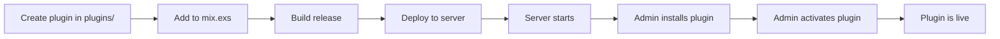

# Plugin Developer Guide

This guide explains how to create, test, and deploy plugins for Voile.

---

## Prerequisites

- Elixir `1.18+` and Erlang `OTP 27+`
- Familiarity with Phoenix and LiveView
- Understanding of Ecto migrations
- Access to a Voile installation for testing

---

## Plugin Location

All Voile plugins are stored in the `plugins/` directory at the project root:

```
voile/
├── lib/voile/           # Core Voile code (untouched by plugins)
├── lib/voile_web/       # Core web interface
├── plugins/             # ← All plugins go here
│   ├── voile_locker_luggage/
│   ├── voile_isbn_lookup/
│   └── voile_exhibit_scheduler/
├── priv/
├── assets/
└── config/
```

This separation ensures:
- Core code remains clean and unmodified
- Plugins are easy to find and manage
- Clear boundary between core and extensions
- Simple git ignore rules for excluding plugins

## Plugin Structure

A plugin is a standard OTP application with a specific structure:

```
plugins/voile_my_plugin/                 # ← Located in plugins/ directory
├── mix.exs                              # OTP app definition
├── README.md
├── lib/
│   ├── voile_my_plugin.ex               # Main module (implements Voile.Plugin)
│   └── voile_my_plugin/
│       ├── migrator.ex                  # Migration runner
│       ├── my_entity.ex                 # Ecto schema(s)
│       ├── my_entities.ex               # Context module(s)
│       ├── settings.ex                  # Settings helper (optional)
│       └── web/
│           └── live/
│               ├── index_live.ex        # Plugin UI
│               └── components/
│                   └── widget.ex        # Dashboard widget (optional)
└── priv/
    └── migrations/
        └── 20240601000001_create_plugin_my_plugin_entities.exs
```

---

## Step 1: Create the OTP Application

Create a new Elixir project in the `plugins/` directory:

```bash
# From Voile root directory
cd plugins
mix new voile_my_plugin --sup
```

Update `mix.exs` to declare dependencies:

```elixir
defmodule VoileMyPlugin.MixProject do
  use Mix.Project

  def project do
    [
      app: :voile_my_plugin,
      version: "1.0.0",
      elixir: "~> 1.18",
      start_permanent: Mix.env() == :prod,
      deps: deps()
    ]
  end

  def application do
    [
      extra_applications: [:logger],
      mod: {VoileMyPlugin.Application, []}
    ]
  end

  defp deps do
    [
      {:phoenix, "~> 1.8"},
      {:phoenix_live_view, "~> 1.0"},
      {:ecto_sql, "~> 3.12"},
      {:voile, path: "../../"}  # Points to Voile root (plugin is in plugins/)
    ]
  end
end
```

---

## Step 2: Implement the Plugin Behaviour

Create the main module that implements `Voile.Plugin`:

```elixir
# lib/voile_my_plugin.ex
defmodule VoileMyPlugin do
  @behaviour Voile.Plugin

  @impl true
  def metadata do
    %{
      id: "my_plugin",                          # Unique snake_case identifier
      name: "My Plugin",
      version: "1.0.0",
      author: "Your Institution",
      description: "Description of what this plugin does.",
      license_type: :free,                      # :free or :premium
      icon: "🔧",                               # Optional emoji icon
      tags: ["utility", "custom"]               # Optional tags
    }
  end

  @impl true
  def on_install do
    # Run migrations - called ONCE when first installed
    VoileMyPlugin.Migrator.run()
  end

  @impl true
  def on_activate do
    # Called when activated (including after server restart)
    # Start any GenServers, schedule jobs, etc.
    :ok
  end

  @impl true
  def on_deactivate do
    # Called when deactivated by admin
    # Stop any processes, but DON'T drop data
    :ok
  end

  @impl true
  def on_uninstall do
    # Called when uninstalling with data removal
    # Rollback migrations (drops tables)
    VoileMyPlugin.Migrator.rollback()
  end

  @impl true
  def on_update(_old_version, _new_version) do
    # Called when plugin is updated
    # Run any new migrations
    VoileMyPlugin.Migrator.run()
  end

  @impl true
  def hooks do
    [
      {:dashboard_widgets, &__MODULE__.add_widget/1},
      {:collection_after_save, &__MODULE__.on_collection_created/1}
    ]
  end

  @impl true
  def routes do
    [
      {"/", VoileMyPlugin.Web.Live.IndexLive, :index},
      {"/settings", VoileMyPlugin.Web.Live.SettingsLive, :settings},
      {"/:id", VoileMyPlugin.Web.Live.ShowLive, :show}
    ]
  end

  @impl true
  def settings_schema do
    [
      %{key: :api_key, type: :string, label: "API Key", required: true, secret: true},
      %{key: :max_items, type: :integer, label: "Max Items", default: 100},
      %{key: :enabled, type: :boolean, label: "Enable Feature", default: true}
    ]
  end

  # Hook handlers
  def add_widget(widgets) do
    widget = %{
      key: :my_plugin_stats,
      title: "My Plugin Stats",
      component: VoileMyPlugin.Web.Components.Widget,
      priority: 50
    }
    widgets ++ [widget]
  end

  def on_collection_created(collection) do
    # React to collection creation
    :ok
  end
end
```

---

## Step 3: Create the Migrator

```elixir
# lib/voile_my_plugin/migrator.ex
defmodule VoileMyPlugin.Migrator do
  use Voile.Plugin.Migrator, otp_app: :voile_my_plugin
end
```

---

## Step 4: Create Database Migrations

```elixir
# priv/migrations/20240601000001_create_plugin_my_plugin_entities.exs
defmodule VoileMyPlugin.Migrations.CreateEntities do
  use Ecto.Migration

  def change do
    # IMPORTANT: Prefix table name with plugin_
    create table(:plugin_my_plugin_entities, primary_key: false) do
      add :id, :binary_id, primary_key: true
      add :name, :string, null: false
      add :node_id, :integer              # Soft reference to Voile nodes
      
      timestamps()
    end

    create index(:plugin_my_plugin_entities, [:node_id])
  end
end
```

!!! warning "Migration Naming"
    - Use globally unique module names: `VoileMyPlugin.Migrations.CreateEntities`
    - Use unique timestamps that don't collide with core migrations
    - Always prefix table names with `plugin_`

---

## Step 5: Create Ecto Schemas

```elixir
# lib/voile_my_plugin/entity.ex
defmodule VoileMyPlugin.Entity do
  use Ecto.Schema
  import Ecto.Changeset

  @primary_key {:id, :binary_id, autogenerate: true}

  schema "plugin_my_plugin_entities" do
    field :name, :string
    field :node_id, :integer    # Soft reference - no FK constraint

    timestamps()
  end

  def changeset(entity, attrs) do
    entity
    |> cast(attrs, [:name, :node_id])
    |> validate_required([:name])
  end
end
```

---

## Step 6: Create Context Module

```elixir
# lib/voile_my_plugin/entities.ex
defmodule VoileMyPlugin.Entities do
  import Ecto.Query
  alias Voile.Repo                    # Use Voile's Repo directly
  alias VoileMyPlugin.Entity

  def list_entities(node_id \\ nil) do
    query = from e in Entity, order_by: [desc: e.inserted_at]
    
    query = if node_id do
      where(query, [e], e.node_id == ^node_id)
    else
      query
    end
    
    Repo.all(query)
  end

  def get_entity!(id), do: Repo.get!(Entity, id)

  def create_entity(attrs) do
    %Entity{}
    |> Entity.changeset(attrs)
    |> Repo.insert()
  end

  def update_entity(%Entity{} = entity, attrs) do
    entity
    |> Entity.changeset(attrs)
    |> Repo.update()
  end

  def delete_entity(%Entity{} = entity) do
    Repo.delete(entity)
  end
end
```

---

## Step 7: Create Settings Helper (Optional)

```elixir
# lib/voile_my_plugin/settings.ex
defmodule VoileMyPlugin.Settings do
  @plugin_id "my_plugin"

  def get(key, default \\ nil) do
    Voile.Plugins.get_plugin_setting(@plugin_id, key, default)
  end

  def put(key, value) do
    Voile.Plugins.put_plugin_setting(@plugin_id, key, value)
  end

  def get_all do
    case Voile.Plugins.get_plugin_by_plugin_id(@plugin_id) do
      nil -> %{}
      record -> record.settings || %{}
    end
  end
end
```

---

## Step 8: Create LiveView UI

```elixir
# lib/voile_my_plugin/web/live/index_live.ex
defmodule VoileMyPlugin.Web.Live.IndexLive do
  use Phoenix.LiveView

  alias VoileMyPlugin.{Entities, Settings}

  @impl true
  def mount(_params, %{"plugin_id" => plugin_id}, socket) do
    entities = Entities.list_entities()
    max_items = Settings.get(:max_items, 100)

    {:ok,
     socket
     |> assign(:entities, entities)
     |> assign(:max_items, max_items)
     |> assign(:plugin_id, plugin_id)
     |> assign(:page_title, "My Plugin")}
  end

  @impl true
  def render(assigns) do
    ~H"""
    <div class="space-y-6">
      <div class="flex items-center justify-between">
        <h2 class="text-2xl font-bold text-gray-900 dark:text-white">
          My Plugin
        </h2>
        <span class="text-sm text-gray-500">
          {@max_items} items max
        </span>
      </div>

      <div class="bg-white dark:bg-gray-800 rounded-lg shadow p-6">
        <ul class="divide-y divide-gray-200 dark:divide-gray-700">
          <li :for={entity <- @entities} class="py-4">
            {entity.name}
          </li>
        </ul>

        <div :if={@entities == []} class="text-center py-8 text-gray-500">
          No entities yet.
        </div>
      </div>
    </div>
    """
  end
end
```

---

## Step 9: Create Dashboard Widget (Optional)

```elixir
# lib/voile_my_plugin/web/components/widget.ex
defmodule VoileMyPlugin.Web.Components.Widget do
  use Phoenix.LiveComponent

  alias VoileMyPlugin.Entities

  @impl true
  def mount(socket) do
    {:ok, assign(socket, :count, Entities.count())}
  end

  @impl true
  def render(assigns) do
    ~H"""
    <div>
      <p class="text-3xl font-bold text-gray-900 dark:text-white">
        {@count}
      </p>
      <p class="text-sm text-gray-500">My Plugin Entities</p>
    </div>
    """
  end
end
```

---

## Using Voile's Storage System

Plugins can use Voile's built-in storage system to upload and manage files. The `Client.Storage` module provides a unified interface that automatically uses the configured storage adapter (local filesystem or S3-compatible storage).

### Basic Usage

```elixir
# In your plugin context module
defmodule VoileMyPlugin.Documents do
  alias Client.Storage

  def upload_document(upload, opts \\ []) do
    # Upload using Voile's configured storage adapter
    case Storage.upload(upload, Keyword.merge([folder: "my_plugin_docs"], opts)) do
      {:ok, url} ->
        # Store the URL in your plugin's schema
        {:ok, url}
      
      {:error, reason} ->
        {:error, reason}
    end
  end

  def delete_document(file_url) do
    Storage.delete(file_url)
  end

  def get_presigned_url(file_key) do
    Storage.presign(file_key)
  end
end
```

### Upload Options

| Option | Description | Default |
|--------|-------------|---------|
| `:folder` | Subfolder for organizing uploads | `"files"` |
| `:unit_id` | Node/unit ID for sharding | `nil` |
| `:generate_filename` | Generate unique filename | `true` |
| `:preserve_extension` | Keep original file extension | `true` |
| `:create_attachment` | Create attachment record in Voile's database | `false` |
| `:adapter` | Override storage adapter | Uses configured adapter |

### Creating Voile Attachments

If your plugin's files should appear in Voile's attachment system:

```elixir
case Storage.upload(upload, 
  folder: "plugin_documents",
  create_attachment: true,
  attachable_id: entity.id,
  attachable_type: "VoileMyPlugin.Entity",
  access_level: "restricted"
) do
  {:ok, url} -> {:ok, url}
  {:error, reason} -> {:error, reason}
end
```

### Storage Adapters

Voile supports two storage adapters:

| Adapter | Module | Use Case |
|---------|--------|----------|
| **Local** | `Client.Storage.Local` | Development, single-server deployments |
| **S3** | `Client.Storage.S3` | Production, cloud storage (AWS S3, MinIO, Backblaze B2) |

The adapter is configured via environment variables or application config:

```bash
# Environment variables
VOILE_STORAGE_ADAPTER=s3  # or "local"
VOILE_S3_ACCESS_KEY_ID=your_key
VOILE_S3_SECRET_ACCESS_KEY=your_secret
```

### Best Practices for Plugin Storage

1. **Use unique folder names** - Prefix with your plugin ID: `folder: "my_plugin_documents"`
2. **Don't create FK constraints** - Store file URLs as strings, not foreign keys
3. **Handle missing files gracefully** - Files may be deleted outside your plugin
4. **Consider access levels** - Use appropriate `access_level` for attachments

---

## Testing

Create tests in your plugin project:

```elixir
# test/voile_my_plugin/entities_test.exs
defmodule VoileMyPlugin.EntitiesTest do
  use Voile.DataCase

  alias VoileMyPlugin.{Entities, Entity}

  setup do
    # Run plugin migrations
    VoileMyPlugin.Migrator.run()
    :ok
  end

  test "create_entity/1 creates an entity" do
    {:ok, entity} = Entities.create_entity(%{name: "Test Entity"})
    assert entity.name == "Test Entity"
  end
end
```

---

## Installation

### Important: Deployment Requirements

!!! warning "Code Deployment Required"
    Adding a new plugin requires rebuilding and redeploying Voile. Plugins are OTP applications that must be compiled into the release.

| Action | Requires Redeploy? | Explanation |
|--------|-------------------|-------------|
| Add new plugin to `mix.exs` | **Yes** | Code must be compiled into the release |
| Install plugin (run migrations) | No | Database operation via admin UI |
| Activate/deactivate plugin | No | In-memory operations via admin UI |
| Server restart | Auto-reactivates | Active plugins are rehydrated from database |

### Deployment Workflow



### 1. Add to Voile's Dependencies

In Voile's `mix.exs`, add the plugin as a path dependency:

```elixir
defp deps do
  [
    # ... other deps
    {:voile_my_plugin, path: "plugins/voile_my_plugin"}  # plugins/ directory
    # or from git (for external plugins):
    # {:voile_my_plugin, git: "https://github.com/org/voile_my_plugin", tag: "v1.0.0"}
  ]
end
```

### 2. Fetch Dependencies

```bash
cd voile
mix deps.get
```

### 3. Start Voile

The plugin OTP app will start automatically with Voile.

### 4. Install via Admin Interface

1. Navigate to `/manage/plugins`
2. Click **Install** on your plugin
3. Click **Activate** to enable it

---

## Best Practices

### Naming Conventions

| Item | Convention | Example |
|------|-----------|---------|
| OTP app | `:voile_` prefix | `:voile_locker_luggage` |
| Main module | `Voile` prefix | `VoileLockerLuggage` |
| Plugin ID | lowercase snake_case | `"locker_luggage"` |
| Table names | `plugin_<id>_<entity>` | `plugin_locker_luggage_lockers` |
| Migration module | `<Module>.Migrations.<Name>` | `VoileLockerLuggage.Migrations.CreateLockers` |

### Golden Rules

1. **Use `Voile.Repo` directly** — no wrapper modules needed
2. **Never create FK constraints** to core tables — use soft references
3. **Always prefix table names** with `plugin_`
4. **Never change the plugin ID** after release
5. **Make `on_install/0` idempotent** — migrations should be re-runnable
6. **Never drop data in `on_deactivate/0`** — only in `on_uninstall/0`
7. **Use globally unique migration module names**
8. **Check for migration version collisions**

---

## Troubleshooting

### Plugin Not Appearing

- Ensure the OTP app is started (check `mix.exs` and application list)
- Verify the module implements `Voile.Plugin` behaviour
- Check for compilation errors

### Migration Errors

- Verify migration timestamps don't collide with core migrations
- Check that table names are prefixed with `plugin_`
- Ensure migration module names are globally unique

### Hooks Not Firing

- Verify plugin is in `:active` state
- Check that hooks are returned from `hooks/0` callback
- Look for errors in logs during activation

### Settings Not Saving

- Verify `settings_schema/0` returns valid field definitions
- Check database for the plugin record
- Ensure plugin is installed before accessing settings
