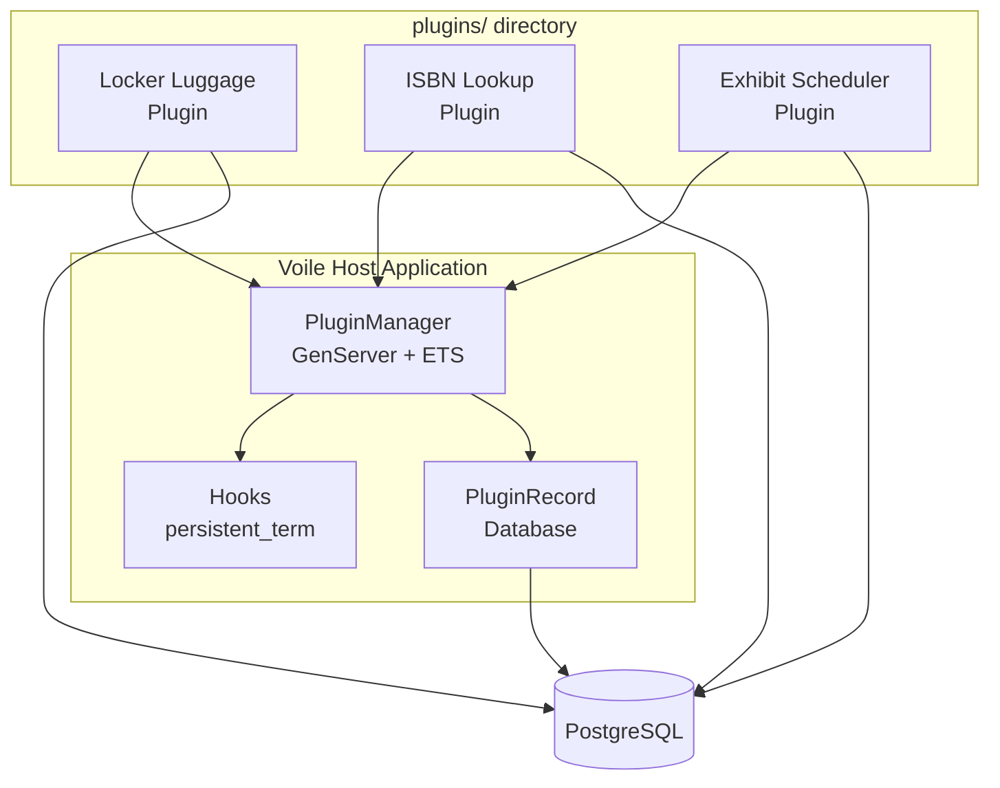

# Plugin System

Voile's plugin system enables institutions to extend the platform with custom features without modifying the core codebase. This is ideal for GLAM (Gallery, Library, Archive, Museum) institutions with unique operational requirements.

---

## Overview

The plugin system allows you to:

- **Extend functionality** — Add new features like locker management, exhibit scheduling, or ISBN enrichment
- **Integrate with external services** — Connect to third-party APIs and data sources
- **Customize workflows** — Hook into core operations like collection saves and item creation
- **Add dashboard widgets** — Display custom statistics and information on the main dashboard
- **Create custom UI** — Build dedicated LiveView interfaces accessible under `/manage/plugins/:plugin_id/`

---

## Key Features

### 🔌 Zero-Cost Hook System

Plugins register hooks that fire during core operations. The hook system uses `:persistent_term` for storage, meaning hook execution has **zero runtime overhead** for reads.

### 🗄️ Shared Database with Namespaced Tables

Plugins use the same PostgreSQL database as Voile core, with tables prefixed by `plugin_` to avoid collisions. No separate database configuration needed.

### 🔄 Full Lifecycle Management

Admins can install, activate, deactivate, and uninstall plugins through the web interface at `/manage/plugins`. Plugin state persists across server restarts.

### ⚙️ Dynamic Settings

Plugins declare a settings schema that automatically generates an admin configuration form. Settings are stored securely in the database.

### 🛡️ Safe Error Handling

Plugin errors are isolated — a failing plugin won't crash the host application. Errors are logged and displayed in the admin interface.

---

## Architecture



### Plugin Location

All plugins are stored in the `plugins/` directory at the Voile project root:

```
voile/
├── lib/voile/           # Core Voile code
├── lib/voile_web/       # Core web interface
├── plugins/             # ← All plugins go here
│   ├── voile_locker_luggage/
│   ├── voile_isbn_lookup/
│   └── voile_exhibit_scheduler/
└── priv/
```

This separation ensures core code remains clean and plugins are easy to manage.

---

## Plugin States

| State | Description |
|-------|-------------|
| **Installed** | Migrations run, tables created, but not yet active |
| **Active** | Fully operational, hooks registered, routes accessible |
| **Inactive** | Deactivated by admin, data preserved, hooks removed |
| **Error** | Installation or activation failed, error message available |
| **Uninstalled** | Removed from system, data optionally preserved |

---

## Available Hooks

Plugins can register handlers for these hook points:

| Hook Name | Type | When It Fires |
|-----------|------|---------------|
| `:dashboard_widgets` | Filter | When rendering the dashboard |
| `:admin_nav_items` | Filter | When building the sidebar navigation |
| `:collection_before_save` | Filter | Before a collection is created |
| `:collection_after_save` | Action | After a collection is created |
| `:item_before_save` | Filter | Before an item is created |
| `:item_after_create` | Action | After an item is created |
| `:visitor_checked_in` | Action | When a visitor checks in |
| `:visitor_session_ended` | Action | When a visitor checks out |
| `:circulation_checkout` | Action | When an item is checked out |
| `:search_results` | Filter | When search results are returned |

---

## Plugin Routes

Each active plugin has its own URL namespace:

```
/manage/plugins/:plugin_id/           → Plugin index page
/manage/plugins/:plugin_id/settings   → Plugin settings
/manage/plugins/:plugin_id/*path      → Plugin-defined routes
```

---

## Security Considerations

!!! warning "Trusted Code Only"
    Plugins are trusted Elixir code that runs in the same VM as Voile. Only install plugins from trusted sources.

- **No sandboxing** — Plugins have full access to the system
- **No hot code loading** — Adding a plugin requires deployment
- **No marketplace** — Plugins are added via `mix.exs` dependencies

---

## For Different Audiences

- **Developers**: See [Developer Guide](developer-guide.md) for creating plugins
- **Librarians & Staff**: See [User Guide](user-guide.md) for managing plugins

---

## Quick Reference

### File Locations

```
lib/voile/
├── plugin.ex              # Behaviour definition
├── plugin_manager.ex      # Lifecycle manager
├── plugin_record.ex       # Database schema
├── plugins.ex             # Context module
├── hooks.ex               # Hook system
└── plugin/
    └── migrator.ex        # Migration macro

lib/voile_web/live/
├── plugin_router_live.ex  # Dynamic routing
└── dashboard/plugins/
    ├── index.ex           # Plugin management page
    └── settings.ex        # Settings form
```

### Database Table

```sql
voile_plugins (
    id, plugin_id, module, name, version,
    author, description, license_type, status,
    settings JSONB, installed_at, activated_at
)
```

### Admin Interface

Navigate to **Settings → Plugins** or visit `/manage/plugins` to manage installed plugins.
