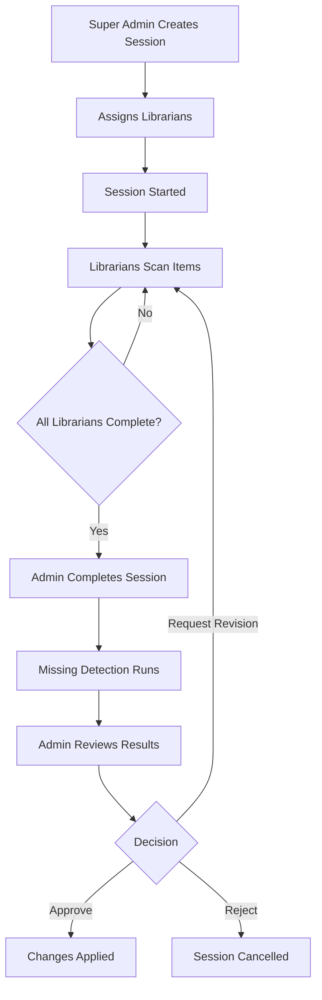

# Stock Opname (Inventory Check)

Stock Opname is VOILE's inventory management feature that allows libraries to conduct systematic physical inventory checks of their collections. This feature ensures accurate tracking of library materials and helps identify missing, damaged, or misplaced items.

## Overview

The Stock Opname system provides:

- **Session-based inventory checks** - Organize inventory work into discrete sessions
- **Multi-librarian support** - Assign multiple librarians to work on a single session
- **Barcode scanning** - Quick item identification using barcode scanners
- **Status tracking** - Track item conditions and availability during checks
- **Missing item detection** - Automatically identify items not scanned during a session
- **Review and approval workflow** - Admin review before applying changes

## Documentation

### Getting Started

- [Quick Reference](quick-reference.md) - Essential commands and workflows
- [Completion Quickstart](completion-quickstart.md) - Fast-track guide for completing sessions

### Design & Architecture

- [Design Document](design.md) - Complete system design and business flow
- [Context Migration](context-migration.md) - Database context organization

### Implementation Details

 - [Async Implementation](async-implementation.md) - Asynchronous processing details

### User Guides

- [Librarian Completion Guide](librarian-completion.md) - Guide for librarians completing their work
- [Collection Fields Editing](collection-fields-editing.md) - Editing collection fields during stock opname

## Workflow Overview

## Session Statuses

| Status | Description | Available Actions |
|--------|-------------|-------------------|
| **Draft** | Just created, not started | Start, Edit, Cancel |
| **In Progress** | Librarians are scanning items | Scan, Complete (admin) |
| **Completed** | Ready for review | Review, Request Revision |
| **Pending Review** | Awaiting admin approval | Approve, Reject, Request Revision |
| **Approved** | Changes have been applied | View only |
| **Rejected** | Session cancelled, no changes | View only |

## Key Features

### For Administrators

- Create and configure inventory sessions
- Define scope (all items, specific collections, or locations)
- Assign librarians to sessions
- Review and approve/reject results
- View comprehensive reports

### For Librarians

- Scan items using barcode or manual entry
- Update item status and condition
- Add notes to items
- Track progress
- Mark work as complete

## Permissions

| Action | Super Admin | Librarian (Assigned) | Librarian (Not Assigned) |
|--------|-------------|---------------------|--------------------------|
| Create Session | ✅ | ❌ | ❌ |
| Start Session | ✅ | ❌ | ❌ |
| Scan Items | ✅ | ✅ | ❌ |
| Complete Work | ✅ | ✅ | ❌ |
| Complete Session | ✅ | ❌ | ❌ |
| Review/Approve | ✅ | ❌ | ❌ |
| View Session | ✅ | ✅ | ✅ |

## URL Paths

- **List Sessions**: `/manage/stock-opname`
- **New Session**: `/manage/stock-opname/new`
- **Session Details**: `/manage/stock-opname/:id`
- **Scan Items**: `/manage/stock-opname/:id/scan`
- **Review**: `/manage/stock-opname/:id/review`

## Related Documentation

- [Catalog Module Guide](../catalog/module-guide.md) - Understanding collections and items
- [RBAC Guide](../../authentication/rbac-complete-guide.md) - Permission management