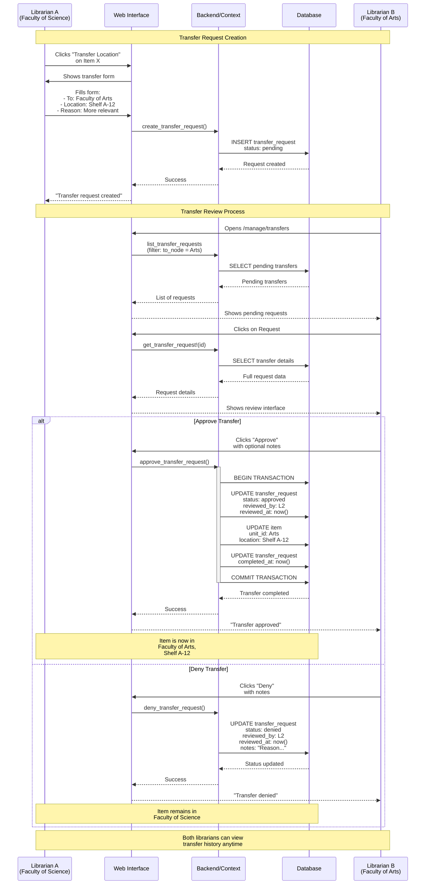
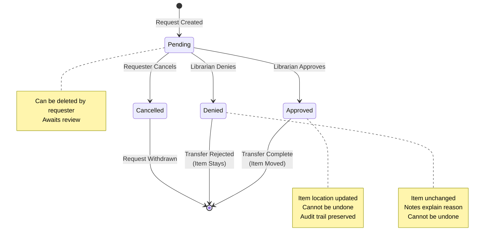
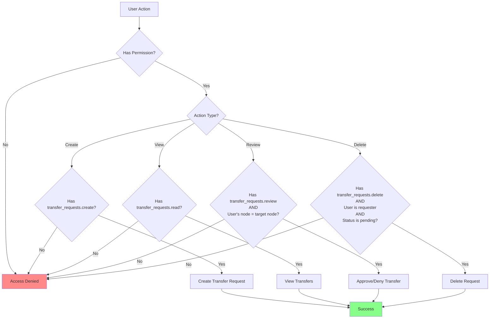
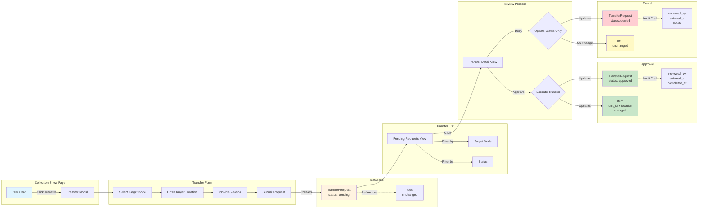

```mermaid
sequenceDiagram
    participant L1 as Librarian A<br/>(Faculty of Science)
    participant UI as Web Interface
    participant BE as Backend/Context
    participant DB as Database
    participant L2 as Librarian B<br/>(Faculty of Arts)

    Note over L1,L2: Transfer Request Creation

    L1->>UI: Clicks "Transfer Location"<br/>on Item X
    UI->>L1: Shows transfer form
    L1->>UI: Fills form:<br/>- To: Faculty of Arts<br/>- Location: Shelf A-12<br/>- Reason: More relevant
    UI->>BE: create_transfer_request()
    BE->>DB: INSERT transfer_request<br/>status: pending
    DB-->>BE: Request created
    BE-->>UI: Success
    UI-->>L1: "Transfer request created"

    Note over L1,L2: Transfer Review Process

    L2->>UI: Opens /manage/transfers
    UI->>BE: list_transfer_requests<br/>(filter: to_node = Arts)
    BE->>DB: SELECT pending transfers
    DB-->>BE: Pending transfers
    BE-->>UI: List of requests
    UI-->>L2: Shows pending requests

    L2->>UI: Clicks on Request
    UI->>BE: get_transfer_request!(id)
    BE->>DB: SELECT transfer details
    DB-->>BE: Full request data
    BE-->>UI: Request details
    UI-->>L2: Shows review interface

    alt Approve Transfer
        L2->>UI: Clicks "Approve"<br/>with optional notes
        UI->>BE: approve_transfer_request()
        
        activate BE
        BE->>DB: BEGIN TRANSACTION
        BE->>DB: UPDATE transfer_request<br/>status: approved<br/>reviewed_by: L2<br/>reviewed_at: now()
        BE->>DB: UPDATE item<br/>unit_id: Arts<br/>location: Shelf A-12
        BE->>DB: UPDATE transfer_request<br/>completed_at: now()
        BE->>DB: COMMIT TRANSACTION
        deactivate BE
        
        DB-->>BE: Transfer completed
        BE-->>UI: Success
        UI-->>L2: "Transfer approved"
        
        Note over L1,DB: Item is now in<br/>Faculty of Arts,<br/>Shelf A-12

    else Deny Transfer
        L2->>UI: Clicks "Deny"<br/>with notes
        UI->>BE: deny_transfer_request()
        BE->>DB: UPDATE transfer_request<br/>status: denied<br/>reviewed_by: L2<br/>reviewed_at: now()<br/>notes: "Reason..."
        DB-->>BE: Status updated
        BE-->>UI: Success
        UI-->>L2: "Transfer denied"
        
        Note over L1,DB: Item remains in<br/>Faculty of Science
    end

    Note over L1,L2: Both librarians can view<br/>transfer history anytime
```

## Transfer States Diagram

```mermaid
stateDiagram-v2
    [*] --> Pending: Request Created

    Pending --> Approved: Librarian Approves
    Pending --> Denied: Librarian Denies
    Pending --> Cancelled: Requester Cancels

    Approved --> [*]: Transfer Complete<br/>(Item Moved)
    Denied --> [*]: Transfer Rejected<br/>(Item Stays)
    Cancelled --> [*]: Request Withdrawn

    note right of Pending
        Can be deleted by requester
        Awaits review
    end note

    note right of Approved
        Item location updated
        Cannot be undone
        Audit trail preserved
    end note

    note right of Denied
        Item unchanged
        Notes explain reason
        Cannot be undone
    end note
```

## Authorization Flow

```mermaid
graph TB
    A[User Action] --> B{Has Permission?}
    
    B -->|No| C[Access Denied]
    B -->|Yes| D{Action Type?}
    
    D -->|Create| E{Has transfer_requests.create?}
    D -->|View| F{Has transfer_requests.read?}
    D -->|Review| G{Has transfer_requests.review<br/>AND<br/>User's node = target node?}
    D -->|Delete| H{Has transfer_requests.delete<br/>AND<br/>User is requester<br/>AND<br/>Status is pending?}
    
    E -->|Yes| I[Create Transfer Request]
    E -->|No| C
    
    F -->|Yes| J[View Transfers]
    F -->|No| C
    
    G -->|Yes| K[Approve/Deny Transfer]
    G -->|No| C
    
    H -->|Yes| L[Delete Request]
    H -->|No| C
    
    I --> M[Success]
    J --> M
    K --> M
    L --> M
    
    style C fill:#f88
    style M fill:#8f8
```

## Data Flow

```mermaid
graph LR
    subgraph "Collection Show Page"
        A[Item Card] -->|Click Transfer| B[Transfer Modal]
    end
    
    subgraph "Transfer Form"
        B --> C[Select Target Node]
        C --> D[Enter Target Location]
        D --> E[Provide Reason]
        E --> F[Submit Request]
    end
    
    subgraph "Database"
        F -->|Creates| G[TransferRequest<br/>status: pending]
        G -.->|References| H[Item<br/>unchanged]
    end
    
    subgraph "Transfer List"
        G --> I[Pending Requests View]
        I -->|Filter by| J[Target Node]
        I -->|Filter by| K[Status]
    end
    
    subgraph "Review Process"
        I -->|Click| L[Transfer Detail View]
        L -->|Approve| M{Execute Transfer}
        L -->|Deny| N{Update Status Only}
    end
    
    subgraph "Approval"
        M -->|Updates| O[TransferRequest<br/>status: approved]
        M -->|Updates| P[Item<br/>unit_id + location<br/>changed]
        O -.->|Audit Trail| Q[reviewed_by<br/>reviewed_at<br/>completed_at]
    end
    
    subgraph "Denial"
        N -->|Updates| R[TransferRequest<br/>status: denied]
        N -->|No Change| S[Item<br/>unchanged]
        R -.->|Audit Trail| T[reviewed_by<br/>reviewed_at<br/>notes]
    end
    
    style A fill:#e1f5ff
    style G fill:#fff3e0
    style O fill:#c8e6c9
    style R fill:#ffcdd2
    style P fill:#c8e6c9
    style S fill:#fff9c4
```
