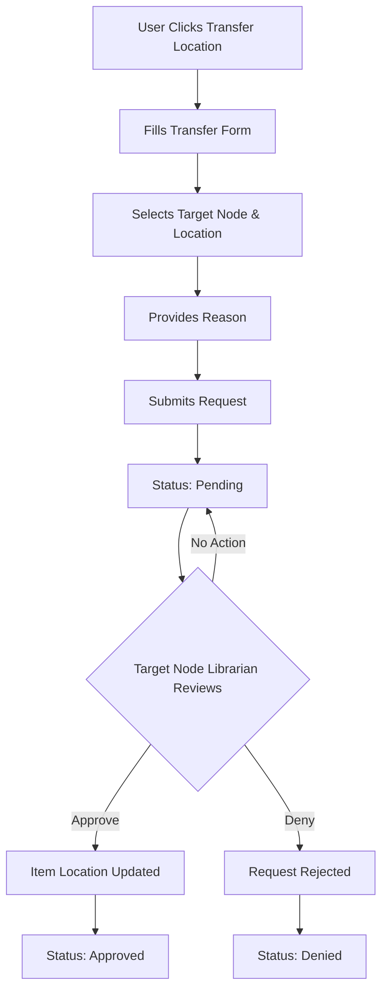

# Transfer Locations

The Transfer Location feature in VOILE allows libraries to manage the movement of items between different branches or nodes. This is essential for multi-branch library systems where materials need to be relocated based on demand, reorganization, or patron requests.

## Overview

The Transfer Location system provides:

- **Request-based workflow** - Users request transfers that require approval
- **Node-based routing** - Transfers are routed to the target branch for review
- **Approval workflow** - Target branch librarians review and approve/deny transfers
- **Audit trail** - Complete history of all transfer requests and decisions
- **Real-time item updates** - Item locations update immediately upon approval

## Documentation

### Getting Started

- [Quick Reference](quick-reference.md) - Essential commands and workflows for transfers
- [Location Guide](location-guide.md) - Complete guide for transfer location management

### Technical Details

 - [Flow Diagrams](flow-diagrams.md) - Visual diagrams of transfer workflows

## Workflow Overview

## Transfer States

| State | Description | Next Actions |
|-------|-------------|--------------|
| **Pending** ⏳ | Awaiting review by target node | Review, Delete (by requester) |
| **Approved** ✅ | Transfer completed, item moved | View only |
| **Denied** ❌ | Transfer rejected with reason | View only |
| **Cancelled** 🚫 | Requester withdrew the request | View only |

## User Roles

### As a Requester

1. Navigate to an item in the collection
2. Click "Transfer Location" button
3. Select the target node and specific location
4. Provide a reason for the transfer
5. Submit and wait for approval

### As a Reviewer (Target Node Librarian)

1. Check `/manage/transfers` for pending requests
2. Review transfer details and reason
3. Approve or deny with notes
4. Item location updates automatically upon approval

## Permissions

| Permission | Description |
|------------|-------------|
| `transfer_requests.create` | Can request transfers |
| `transfer_requests.read` | Can view transfers |
| `transfer_requests.update` | Can edit transfers |
| `transfer_requests.delete` | Can delete own pending requests |
| `transfer_requests.review` | Can approve/deny transfers |

**Default Role Access:**

- `super_admin` → All permissions
- `librarian` → All permissions
- Other roles → No access by default

## URL Paths

- **View All Transfers**: `/manage/transfers`
- **View Transfer Detail**: `/manage/transfers/:id`

## Key Features

### For Staff

- Quick transfer initiation from item detail pages
- Clear status tracking for all requests
- Ability to cancel pending requests
- View complete transfer history

### For Librarians

- Filtered view of transfers for their node
- Approve/deny with notes
- Batch review capabilities
- Audit trail for accountability

## Important Notes

- ✅ Transfers execute immediately upon approval
- ✅ Item location updates are permanent
- ✅ Only target node librarians can review
- ✅ Full audit trail is maintained
- ⚠️ Cannot undo approved/denied transfers
- ⚠️ Can only delete your own pending requests

## Related Documentation

- [Catalog Module Guide](../catalog/module-guide.md) - Understanding items and collections
- [Node Loan Rules](../../configuration/node-loan-rules.md) - Node configuration
- [RBAC Guide](../../authentication/rbac-complete-guide.md) - Permission management