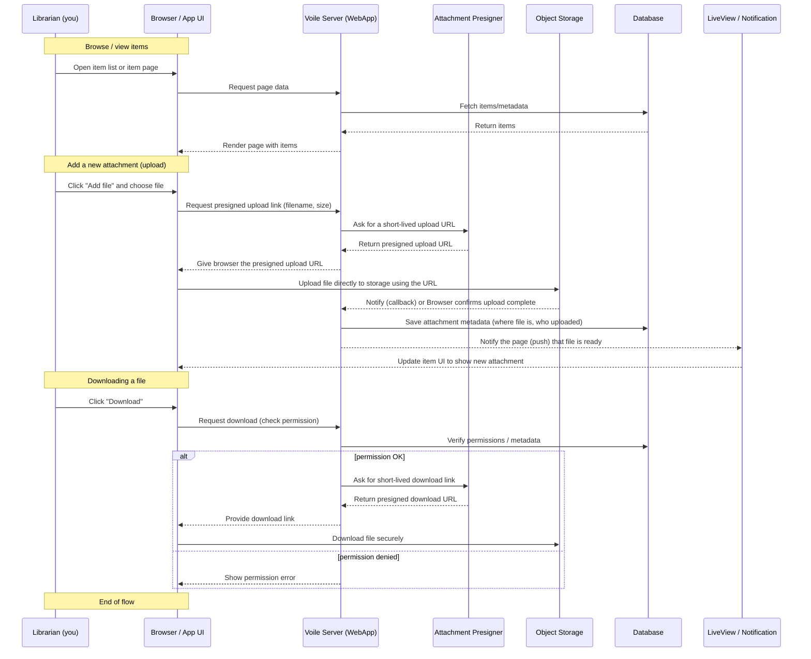

# How Voile Works — Simple Sequence for Librarians

This page explains, in simple non-technical language, how the Voile app handles browsing items, adding attachments, and downloading files. A visual sequence diagram (Mermaid) follows illustrating the steps.

## Plain English Summary

- When you open a page, the app shows items (books, records) from the database.
- To add a file (for example, a scanned page or image), the app briefly asks the server for a secure upload link. This keeps your files safe.
- You then upload the file directly to the storage space using that secure link. The app is notified when the upload finishes.
- The server records the file details (where it is, who uploaded it) in the system and the new file appears in the app.
- When you download a file, the app checks you have permission and then gives you a safe link to download the file.

This flow keeps file transfers fast (your browser talks directly to storage) while preserving security and accurate records in the system.

---

## Mermaid Sequence Diagram (simple)



---

## Helpful Notes for Librarians

- "Presigned link" = a safe, short-lived URL that lets your browser upload/download a file directly to storage. It prevents files from passing through the main server and improves speed and security.
- The server always records the file details (name, size, who added it) so librarians can find and manage files later.
- If an upload fails, the app will show an error and you can retry. If you see permission errors when downloading, contact an administrator to check your access.

File: `/docs/sequence_for_librarians.md` — created to provide a non-technical, visual sequence describing common app workflows for librarians and other non-technical users.

---

## Circulation — Borrowing, Returning, Reserving (plain English)

This section explains how the library circulation parts of Voile work in simple terms: checking out items to patrons, returning them, placing holds (reservations), renewing loans, and handling fines.

- Checkout (Borrowing):

  1. The librarian finds the member (by name, ID, or barcode) and the item (scan or enter the item code).
  2. The system checks the member can borrow (no suspension, fines under limit) and that the item is available.
  3. If all good, the system creates a "loan" with a due date and marks the item as checked out.
  4. The receipt or confirmation appears and the item leaves the available status.

- Return:

  1. The librarian scans the item when it is returned.
  2. The system finds the active loan and checks if the item is late.
  3. If overdue, the system calculates a fine. The librarian can record a payment or waive it if appropriate.
  4. The loan is closed and the item becomes available again (or set for pickup if someone reserved it).

- Reservation (Hold):

  1. If an item is checked out, a patron can place a reservation (hold).
  2. Reservations are queued: first-come, first-served.
  3. When the item is returned, the system marks it as "available" for the first person in the queue and notifies them.
  4. The patron has a small window to pick it up; if they don't, the reservation may expire and the next person is notified.

- Renewal:

  1. A patron or librarian can request to extend a loan before the due date.
  2. The system checks renewal rules (not overdue, not reserved by another patron, renewal limits).
  3. If allowed, the due date is extended and the loan updated.

- Fines and Payments:
  - Fines are typically generated when items are returned late (daily rates apply).
  - The system records fines on the member's account; payments can be processed and receipts issued.
  - Fines may lead to temporary suspension if they exceed configured limits.

### Simple Circulation Sequence Diagram (Mermaid)

```mermaid
sequenceDiagram
  participant Librarian as Librarian
  participant Browser as App UI
  participant WebApp as Voile Server
  participant DB as Database
  participant Notifier as Notification System

  Note over Librarian,Browser: Checkout (Borrow an item)
  Librarian->>Browser: Enter/scan member + scan item
  Browser->>WebApp: Request checkout
  WebApp->>DB: Check member & item availability
  alt eligible & available
    WebApp->>DB: Create loan; set due date; mark item checked_out
    WebApp-->>Browser: Confirm checkout
  else ineligible or unavailable
    WebApp-->>Browser: Show error (account/fines/unavailable)
  end

  Note over Librarian,Browser: Return
  Librarian->>Browser: Scan returned item
  Browser->>WebApp: Request return
  WebApp->>DB: Find active loan; calculate overdue
  alt overdue
    WebApp-->>Browser: Show fine amount; request payment
    Browser->>WebApp: Record payment (if any)
  end
  WebApp->>DB: Close loan; mark item available
  WebApp->>Notifier: Check reservations and notify next patron
  Notifier-->>Browser: Notify (if applicable)

  Note over Librarian,Browser: Reservation
  Librarian->>Browser: Place hold for patron
  Browser->>WebApp: Create reservation
  WebApp->>DB: Add to reservation queue
  WebApp-->>Browser: Confirm reservation placed

  Note over Librarian,Browser: End of circulation flow
```

These descriptions map to the Circulation dashboards and actions you use daily: quick checkout, quick return, renew, and manage reservations. If you want, I can produce a printable one-page handout of these steps.

---

## Fines — librarian dashboard, patron (Atrium), and the Fine Bot

This section explains how fines are created, managed, and paid from two viewpoints: the librarian using the dashboard and the patron using the Atrium (user-facing portal). It also describes the automated Fine Bot that calculates and notifies about fines.

### Librarian view (Dashboard)

- Where fines appear:

  - Circulation dashboard shows totals (outstanding, paid, overdue), lists of fines, and quick actions.
  - Member profile and transaction detail pages show itemized fines and payment history.

- Common librarian actions:

  1. View outstanding fines for a member from their profile.
  2. Create a manual fine (damage, lost item) with reason and amount.
  3. Record payments (cash, card, online), including partial payments; the system updates the remaining balance.
  4. Waive or reduce a fine (requires permission); all changes are logged for audit.
  5. Generate receipts and email or print them for patrons.
  6. Run reconciliation reports and export payment history.

- Typical return with fine flow:
  1. Item is scanned on return.
  2. System calculates overdue amount and prompts the librarian.
  3. Librarian records payment or flags for later collection.
  4. Loan is closed and item status updated.

### Patron view (Atrium)

- What patrons see and can do:

  - View outstanding balance and an itemized list of fines on their Atrium account page.
  - Pay fines online (if enabled) or view payment instructions and receipts.
  - See notifications about new fines or reminders sent by the library.
  - Request review or contact staff if they dispute a fine.

- Typical patron actions:
  1. Open Atrium -> Account -> Fines to view details.
  2. Click "Pay" to pay full or partial balance using available payment methods.
  3. Download or receive a receipt after payment.
  4. If borrowing is restricted due to fines, follow instructions on how to clear the hold (payment or staff assistance).

### Fine Bot (automated background worker)

The Fine Bot runs on a schedule (for example, nightly) to keep fines up to date and to notify patrons. Its responsibilities:

- Actions:
  1. Detect overdue loans and compute fines using configured rules (daily rate × days late).
  2. Create or update fine records in the database with the calculated amount and link to the loan.
  3. Send initial and follow-up reminder notifications to patrons via email/SMS depending on configuration.
  4. Apply policy-driven escalations, e.g., block borrowing after thresholds or after several missed reminders.
  5. Log actions for staff review and allow staff to reverse or adjust fines when necessary.

### Fine Bot sequence (simple Mermaid)

```mermaid
sequenceDiagram
  participant Bot as Fine Bot
  participant DB as Database
  participant WebApp as Voile Server
  participant Notifier as Notification System
  participant Patron as Patron (Atrium)

  Bot->>DB: Find overdue loans
  DB-->>Bot: Return list of overdue loans
  Bot->>DB: Create/Update fine records (amount, loan id)
  Bot->>Notifier: Send reminder to patron
  Notifier-->>Patron: Deliver reminder

  Patron->>WebApp: Visit Atrium -> view fines
  Patron->>WebApp: Submit payment
  WebApp->>DB: Record payment; update fine status
  WebApp-->>Notifier: Send receipt/confirmation

  Note over Bot,WebApp: Staff may adjust or waive fines via Dashboard; all actions are audited.
```

### Permissions, audit, and edge cases

- Only staff with the correct role can create manual fines, waive them, or mark them paid on behalf of patrons.
- All fine-related actions (create, edit, waive, payment) are recorded in an audit log.
- Edge cases:
  - Bot should update existing fine records for the same loan rather than creating duplicates.
  - Partial payments and retries must track the remaining balance correctly.
  - Disputes should have a clear review path and staff notes to document resolution.

These additions explain how fines are surfaced and handled in both the librarian dashboard and the patron-facing Atrium, and how automation via the Fine Bot helps with routine calculations and reminders.
