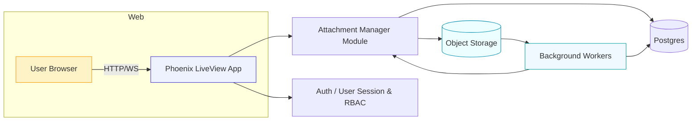
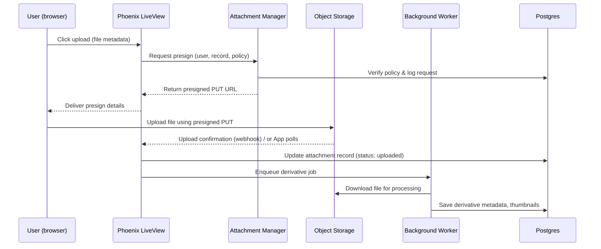

# Voile: Secure Attachments & Live UI — Presentation

Presenter: [Your name]  
Date: [Meeting date]  
Audience: Head of Library, Librarian(s)

---

## How to use this file

- Copy each "Slide N" heading into a new slide in Google Slides.
- Copy the bullet list under the heading into the slide body.
- Copy the "Speaker notes" into the speaker notes area of Google Slides.
- For Mermaid diagrams: paste the fenced code block into a Mermaid editor (https://mermaid.live or VS Code Mermaid preview) and export PNG/SVG to insert into slides.

---

## Slide 1 — Title

- Voile: Secure Attachments & Live UI for Library Workflows
- Presenter: [Your name], Date: [Meeting date]
- Audience: Head of Library, Librarian(s)

**Speaker notes:**

- Quick welcome, explain this will be a short walk-through of what Voile does for attachment handling, UX, and how it fits our library workflows.

---

## Slide 2 — Agenda

- Problem we solve
- High-level solution overview
- Architecture diagram
- Attachment access & presign flow
- Live UI & streaming behavior
- Security and access control
- Demo plan & screenshots
- Roadmap & next steps
- Q&A

**Speaker notes:**

- Mention we'll focus on practical impacts for the library (security, ease of upload/access, scalability).

---

## Slide 3 — Problem (what libraries face)

- Need to attach/serve files (images, PDFs, audio) to records securely
- Ensure correct access control by role/user/collection
- Avoid storing sensitive attachments publicly
- Provide good UX for upload and preview in the web UI
- Handle large files efficiently (presigned uploads, streaming)

**Speaker notes:**

- Connect to library needs: protected resources, embargoed or restricted files, staff upload workflows, patron-facing previews.

---

## Slide 4 — Voile: Solution summary

- Phoenix + LiveView web app tailored for library attachments
- Secure presigned uploads to object storage
- Fine-grained access control (RBAC & presign policies)
- Live UI: streaming lists, instant upload feedback, previews
- Extensible: background processing (transcoding, thumbnails)

**Speaker notes:**

- Emphasize that the approach separates file storage from app and keeps access guarded.

---

## Slide 5 — High-level architecture (visual)

- App (Phoenix LiveView) — handles UI, auth, policies
- Attachment manager — presign, metadata, permissions
- Object storage (S3-compatible) — stores files (private)
- Background workers — derivatives, thumbnails, virus scans
- Database (Postgres) — metadata, access logs

**Speaker notes:**

- Explain each box briefly; note that presign keeps uploads efficient and secure.

**Mermaid architecture diagram (paste into a Mermaid renderer):**



---

## Slide 6 — Attachment presign flow (sequence)

- User clicks upload in UI
- App requests presign from Attachment Manager with metadata & policy
- Attachment Manager verifies permission and creates presigned URL
- Browser uploads directly to Object Storage using presign
- App receives upload-complete webhook or verifies via DB
- Background worker processes derivatives and updates metadata

**Speaker notes:**

- Emphasize security: app never exposes storage credentials and checks policies before issuing presigned URLs.

**Mermaid presign sequence (paste into a Mermaid renderer):**



---

## Slide 7 — Access control & security

- Policies evaluated at presign time (who can upload/download)
- Short-lived presigned URLs (minimize window)
- Private object storage buckets; downloads served by presign or signed proxy
- Audit logging (who accessed/when)
- Support for embargoed or staged release via metadata

**Speaker notes:**

- Highlight that security is central: policy checks, short-lived URLs, and audit trails.

---

## Slide 8 — Live UI & Streams (UX)

- Streaming lists for large collections (LiveView streams)
- Real-time upload progress and immediate stream append
- Preview thumbnails and click-to-download
- In-place processing indicators (queued, processing, ready)
- Form integration using `<.form>` and `<.input>` components

**Speaker notes:**

- Mention the UX reduces page reloads and makes staff workflow faster.

**Mermaid LiveView stream snippet:**

```mermaid
flowchart LR
  subgraph LiveView
    V[LiveView socket]
    V --> |stream(:attachments)| L[Attachments stream]
    L --> UI[UI list with phx-update="stream"]
  end
  UI --> User
```

---

## Slide 9 — Operational aspects

- Background workers scale independently for heavy processing
- Storage bucket lifecycle rules for temp/derivatives
- Use Req library for outgoing HTTP (recommended)
- Tests and LiveViewTest coverage for key UI flows
- Deploy using existing container/rel scripts (images included in repo)

**Speaker notes:**

- Note that common operational tasks are automated and the repo includes deployment helpers.

---

## Slide 10 — Demo plan (what to show)

- Quick upload flow: create record + upload file + watch stream append
- Show presigned URL usage (inspector/network) and explain short-lived URL
- Show preview & download respects permissions (try as different role)
- Show background processing: thumbnail creation & status change

**Speaker notes:**

- Recommend a 5–7 minute live demo; have a pre-uploaded example just in case.

---

## Slide 11 — Screenshots & where to capture them

- Upload form (show `<.form>` & progress)
- Stream list showing appended item with thumbnail
- Network panel capture of PUT to S3 with presigned URL
- Admin view for access logs/audit

**Speaker notes:**

- If demo fails, switch to screenshots and walk through steps.

---

## Slide 12 — Roadmap & next steps

- Integrate virus scanning pipeline (next sprint)
- Add more derivative types (audio transcripts, OCR)
- Admin UI for policy management & audit queries
- User testing with library staff & collect feedback
- Production hardening and SLA for background workers

**Speaker notes:**

- Ask for priorities from the head of library: which features should be prioritized.

---

## Slide 13 — Risks & mitigations

- Risk: misconfigured presign policies -> mitigation: unit tests & policy linting
- Risk: large files blocking workers -> mitigation: autoscaling, queue backpressure
- Risk: user confusion with access -> mitigation: clear UI notifications & admin docs

**Speaker notes:**

- Keep concise; show you considered operations and UX.

---

## Slide 14 — Q&A / Contact

- Questions?
- Contact: [your email]
- Repo: curatorian/voile — invite to review code or request features

**Speaker notes:**

- Offer to run a follow-up hands-on session with staff.

---

# Visual assets & rendering tips

- For Mermaid: use the Mermaid Live Editor (https://mermaid.live) or the VS Code Mermaid Preview extension, render to PNG and paste into your slide.
- Colors: use calm palette (blues/teals) for system components and orange/yellow for user/browser.
- Icons: use heroicons (available in the project vendor) — upload as small icons next to each diagram box in slides.
- Screenshots: capture the live upload flow and network inspector (show the presigned PUT request and response headers).
- For thumbnails: show before/after processing state using a two-column image.

---

# Quick copyable Mermaid artifacts (all in one place)

## Architecture


## Presign upload sequence


## LiveView stream

```mermaid
flowchart LR
  subgraph LiveView
    V[LiveView socket]
    V --> |stream(:attachments)| L[Attachments stream]
    L --> UI[UI list with phx-update="stream"]
  end
  UI --> User
```

---

# Presentation tips & timing

- Total length: ~15–20 minutes with 5–7 minute demo.
- Slide timing: Title (30s), Agenda (30s), Problem (1m), Solution (1m), Architecture (2m), Presign flow (2m), Live UI (1m), Ops (1m), Demo (5-7m), Roadmap & Q&A (3-4m).
- Keep demo short and rehearsed; have fallback screenshots.

---

# Deliverables

- Markdown: `docs/voile_presentation.md` (this file)
- Included: copy-paste slide texts (Slides 1–14), Mermaid diagrams, speaker notes, visual guidance, and presentation tips.

---

# Next steps (optional)

- I can render the Mermaid diagrams to PNG and package them for easy insertion into Google Slides.
- I can produce a PDF of the slides for a handout.
- I can tailor the slides for a non-technical audience (policy & operations focus).

If you want one of the above, tell me which and I will prepare it.
