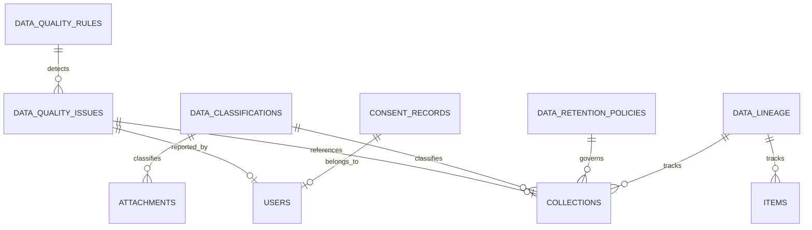

# VOILE Project - DAMA-DMBOK Alignment Analysis & Recommendations

## Executive Summary

VOILE (Virtual Organized Information & Library Ecosystem) is a GLAM-focused digital library management system built with Elixir/Phoenix. After analyzing the codebase, schema, and architecture, I've mapped the project against DAMA-DMBOK's 11 Knowledge Areas and identified strengths, gaps, and recommendations.

---

## DAMA-DMBOK Knowledge Area Assessment

### 1. Data Governance ✅ **Strong Implementation**

**Current Strengths:**
- Comprehensive RBAC system with GLAM-specific roles ([`rbac-complete-guide.md`](docs/authentication/rbac-complete-guide.md))
- Role-based scoping with `glam_type` constraint (Library, Archive, Gallery, Museum)
- Audit logging via [`CollectionLogger`](lib/voile/utils/collection_logger.ex) with IP, user agent, session tracking
- `collection_permissions` table for fine-grained access control
- System roles: `super_admin`, `librarian`, `archivist`, `gallery_curator`, `museum_curator`

**Gaps & Recommendations:**
| Gap | Recommendation |
|-----|----------------|
| No formal Data Governance Council | Establish governance policies and stewardship roles |
| No data ownership metadata | Add `data_owner_id`, `data_steward_id` to collections |
| No data classification framework | Implement data classification levels (Public, Internal, Confidential, Restricted) |
| No retention policies | Add `retention_schedule` and `disposition_rules` tables |

---

### 2. Data Architecture ✅ **Well Designed**

**Current Strengths:**
- UUID-based primary keys for distributed uniqueness
- JSONB columns for flexible metadata storage
- Proper indexing strategy (GIN, trigram, covering indexes)
- Polymorphic attachments via `attachable_type`/`attachable_id`
- Custom PostgreSQL enums for domain consistency

**Schema Overview:**
```
┌─────────────────────────────────────────────────────────────┐
│                    VOILE Data Architecture                   │
├─────────────────────────────────────────────────────────────┤
│  ┌─────────────┐    ┌─────────────┐    ┌─────────────┐     │
│  │   Users     │───▶│   Roles     │───▶│ Permissions │     │
│  │  (RBAC)     │    │  (GLAM)     │    │  (CRUD)     │     │
│  └─────────────┘    └─────────────┘    └─────────────┘     │
│         │                                                   │
│         ▼                                                   │
│  ┌─────────────┐    ┌─────────────┐    ┌─────────────┐     │
│  │ Collections │───▶│   Items     │───▶│ Attachments │     │
│  │  (GLAM)     │    │  (Physical) │    │  (Files)    │     │
│  └─────────────┘    └─────────────┘    └─────────────┘     │
│         │                                                   │
│         ▼                                                   │
│  ┌─────────────┐    ┌─────────────┐    ┌─────────────┐     │
│  │  Metadata   │    │  Resource   │    │   Master    │     │
│  │ Vocabularies│    │  Templates  │    │    Data     │     │
│  └─────────────┘    └─────────────┘    └─────────────┘     │
└─────────────────────────────────────────────────────────────┘
```

**Gaps & Recommendations:**
| Gap | Recommendation |
|-----|----------------|
| No data lineage tracking | Add `data_lineage` table to track data flow |
| No conceptual data model documentation | Create entity-relationship diagrams for each domain |
| No versioning for schema changes | Implement schema versioning with migration rollback tests |

---

### 3. Data Quality ⚠️ **Partial Implementation**

**Current Strengths:**
- Database constraints (check constraints for barcode length, date consistency)
- Ecto changeset validations
- `stock_opname_items.changes` JSONB for tracking data modifications

**Gaps & Recommendations:**
| Gap | Recommendation | Priority |
|-----|----------------|----------|
| No data quality rules engine | Create `data_quality_rules` table with rule definitions | High |
| No data profiling capabilities | Add data profiling functions for collection analysis | Medium |
| No duplicate detection | Implement fuzzy matching for duplicate collections/items | High |
| No data quality metrics | Add `data_quality_scores` table with dimensions: completeness, accuracy, consistency | Medium |
| No data cleansing workflows | Create data steward review queue for data issues | Medium |

**Recommended Schema Addition:**
```elixir
# New table: data_quality_rules
schema "data_quality_rules" do
  field :name, :string
  field :description, :text
  field :rule_type, :string  # "completeness", "accuracy", "consistency", "uniqueness"
  field :entity_type, :string  # "collection", "item", "user"
  field :field_name, :string
  field :rule_expression, :string
  field :severity, :string  # "error", "warning", "info"
  field :is_active, :boolean, default: true
end
```

---

### 4. Data Security ✅ **Strong Implementation**

**Current Strengths:**
- Password hashing with `Argon2`
- API token scoping with `ip_whitelist`, `expires_at`, `revoked_at`
- Attachment access control (`attachment_role_access`, `attachment_user_access`)
- Embargo dates for attachments (`embargo_start_date`, `embargo_end_date`)
- Session-based authentication with `current_scope`

**Gaps & Recommendations:**
| Gap | Recommendation |
|-----|----------------|
| No encryption at rest for sensitive fields | Encrypt PII fields (address, phone_number) using `cloak` library |
| No data masking for non-production environments | Implement data masking for seeds/test data |
| No audit trail for data exports | Log all data export operations with user context |
| No GDPR compliance features | Add `consent_tracking`, `data_subject_requests` tables |

---

### 5. Data Integration & Interoperability ✅ **Good Implementation**

**Current Strengths:**
- OAI-PMH 2.0 implementation ([`Voile.OaiPmh`](lib/voile/oai_pmh.ex)) with `oai_dc` and `marc21` formats
- Resumption tokens for large dataset harvesting
- Migration tools for legacy data import ([`biblio_importer.ex`](lib/voile/migration/biblio_importer.ex))
- CSV import for collections ([`collection_csv_importer.ex`](lib/voile/catalog/collection_csv_importer.ex))

**Gaps & Recommendations:**
| Gap | Recommendation |
|-----|----------------|
| No REST API documentation | Generate OpenAPI/Swagger documentation |
| No webhook notifications | Add webhooks for collection lifecycle events |
| No data synchronization tracking | Create `integration_logs` table for external system syncs |
| Limited metadata format support | Add MODS, METS, EAD formats for archival materials |

---

### 6. Document & Content Management ✅ **Strong Implementation**

**Current Strengths:**
- Polymorphic attachment system with folder hierarchy
- Multiple storage backends (local, S3) via [`Storage`](lib/client/storage.ex) client
- File type validation and size constraints
- Primary attachment designation (`is_primary`)
- Access level control per attachment

**Gaps & Recommendations:**
| Gap | Recommendation |
|-----|----------------|
| No digital preservation features | Add format migration tracking, fixity checking |
| No OCR/text extraction | Integrate Tesseract or similar for searchable PDFs |
| No watermarking | Add watermark support for image attachments |
| No versioning for attachments | Implement attachment versioning with rollback |

---

### 7. Reference & Master Data ✅ **Good Implementation**

**Current Strengths:**
- Master tables: `mst_creator`, `mst_publishers`, `mst_locations`, `mst_places`, `mst_topics`, `mst_frequency`
- Member types with loan rules (`mst_member_types`)
- Nodes (organizational units) with proper scoping
- Resource classes with GLAM type categorization

**Gaps & Recommendations:**
| Gap | Recommendation |
|-----|----------------|
| No master data governance | Add `approved`, `approved_by`, `approved_at` fields |
| No de-duplication for master data | Implement fuzzy matching for creator/publisher dedup |
| No external authority linking | Add `authority_source`, `authority_id` (e.g., VIAF, ORCID) |
| No change history for master data | Add `master_data_history` audit table |

---

### 8. Metadata Management ✅ **Strong Implementation**

**Current Strengths:**
- Vocabulary management ([`metadata_vocabularies`](lib/voile/schema/metadata.ex))
- Property definitions with type validation
- Resource templates with property ordering
- GLAM-specific resource classes
- Multi-language support (`value_lang` field)

**Gaps & Recommendations:**
| Gap | Recommendation |
|-----|----------------|
| No controlled vocabulary enforcement | Add validation against vocabulary terms |
| No metadata standards mapping | Map to Dublin Core, ISAD(G), DACS standards |
| No metadata quality scoring | Implement completeness metrics per collection |
| No linked data support | Add RDF/JSON-LD export capabilities |

---

### 9. Data Warehousing & Business Intelligence ⚠️ **Partial Implementation**

**Current Strengths:**
- Analytics dashboard ([`Voile.Analytics.Dashboard`](lib/voile/analytics/dashboard.ex))
- Search analytics ([`Voile.Analytics.SearchAnalytics`](lib/voile/analytics/search_analytics.ex))
- Collection statistics by status, GLAM type

**Gaps & Recommendations:**
| Gap | Recommendation | Priority |
|-----|----------------|----------|
| No data warehouse | Create analytical data store for reporting | High |
| No ETL pipelines | Implement scheduled ETL for analytics aggregation | High |
| No KPI dashboards | Add circulation KPIs, collection growth metrics | Medium |
| No predictive analytics | Implement ML-based recommendations | Low |

---

### 10. Data Modeling & Design ✅ **Well Implemented**

**Current Strengths:**
- Ecto schemas with proper relationships
- Migration-based schema evolution
- JSONB for flexible metadata
- Enum types for domain consistency

**Gaps & Recommendations:**
| Gap | Recommendation |
|-----|----------------|
| No data dictionary | Generate comprehensive data dictionary from schemas |
| No conceptual model documentation | Document business entities and relationships |
| No naming convention enforcement | Add linter rules for schema field naming |

---

### 11. Data Storage & Operations ✅ **Good Implementation**

**Current Strengths:**
- PostgreSQL 14+ with extensions (`citext`, `pg_trgm`)
- Connection pooling via Ecto
- Index optimization for common queries
- Statistics tuning for query planner

**Gaps & Recommendations:**
| Gap | Recommendation |
|-----|----------------|
| No backup automation documentation | Document backup/restore procedures |
| No disaster recovery plan | Create DR documentation and test procedures |
| No database monitoring | Add database performance monitoring (Oban, Telemetry) |
| No data archiving strategy | Implement cold storage for old transactions |

---

## Priority Roadmap for DAMA-DMBOK Alignment

### Phase 1: Foundation (High Priority)
1. **Data Quality Rules Engine** - Implement validation rules framework
2. **Data Classification** - Add classification levels to collections
3. **Data Lineage Tracking** - Track data provenance and transformations
4. **Backup & DR Documentation** - Document operational procedures

### Phase 2: Enhancement (Medium Priority)
1. **Data Quality Metrics** - Implement scoring and dashboards
2. **Master Data Governance** - Add approval workflows
3. **API Documentation** - Generate OpenAPI specs
4. **Digital Preservation** - Add fixity checking and format migration

### Phase 3: Advanced (Lower Priority)
1. **Data Warehouse** - Create analytical data store
2. **Linked Data Support** - RDF/JSON-LD exports
3. **Predictive Analytics** - ML-based recommendations
4. **GDPR Compliance** - Data subject request handling

---

## Recommended New Schema Elements



---

## Conclusion

VOILE demonstrates strong alignment with DAMA-DMBOK in several areas, particularly Data Governance (RBAC), Data Architecture, Data Security, and Metadata Management. The main gaps are in Data Quality (formal rules engine), Data Warehousing (analytical capabilities), and Reference Data governance.

The project is well-positioned to become a DAMA-DMBOK compliant system with the recommended enhancements. The modular Phoenix architecture allows for incremental implementation of these improvements.